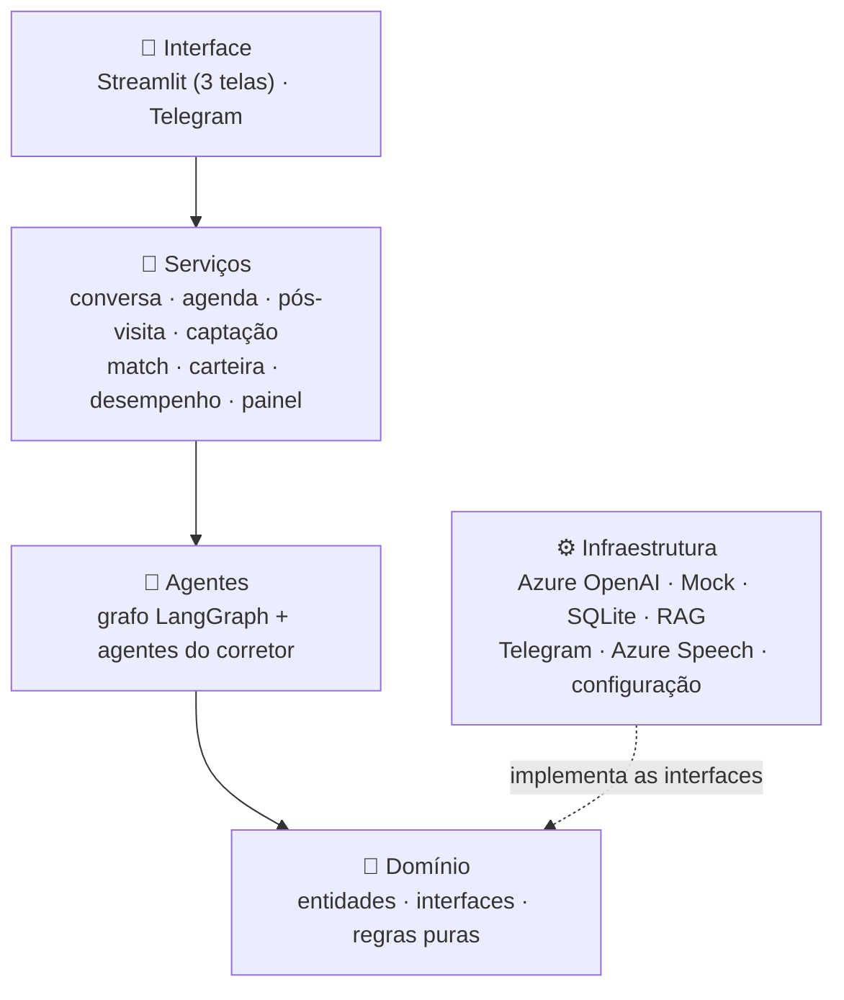
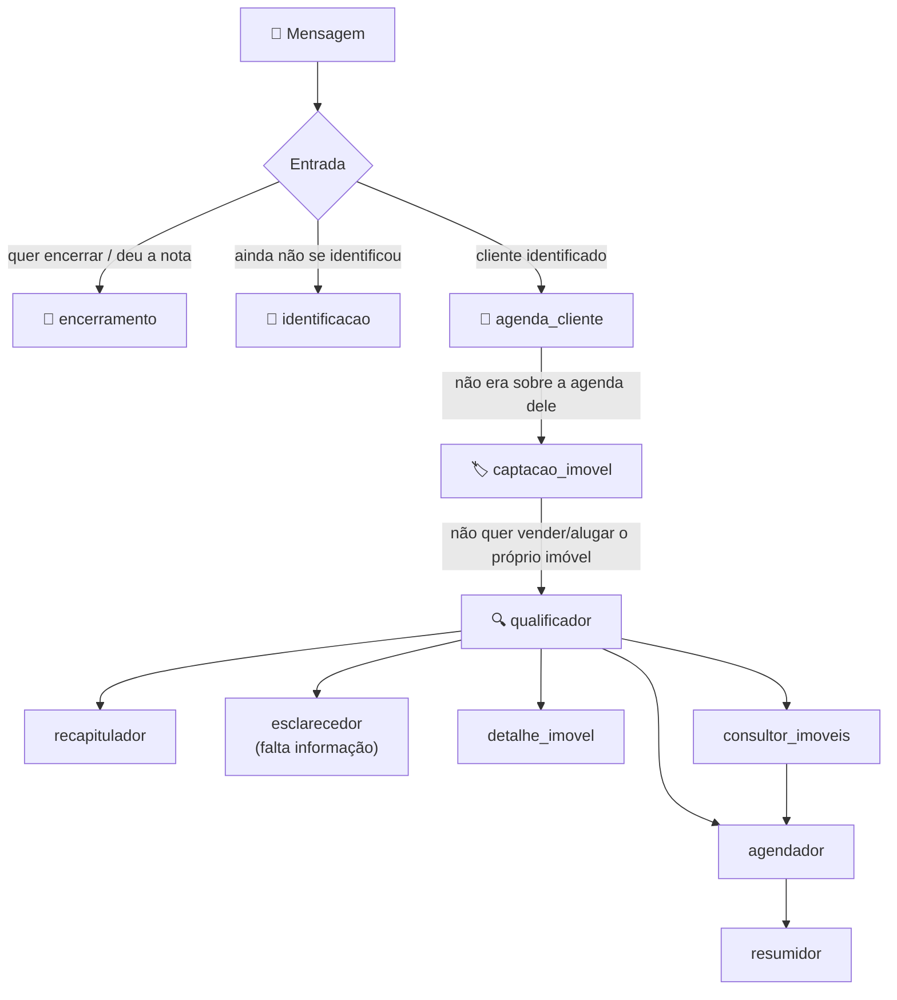

# 🏠 Sr. Agim — Agente Imobiliário com IA Generativa

Prova de Conceito (POC) do **Tech Challenge — Fase 5 da Pós-Graduação em IA da FIAP**, no Hackathon *"Agente SDR Imobiliário com Inteligência Artificial"*.

O **Sr. Agim** (**Ag**ente **Im**obiliário) é um atendente virtual de imobiliária. Ele conversa com o cliente pelo navegador ou pelo Telegram, entende o que a pessoa procura (comprar, alugar, investir ou vender o próprio imóvel), sugere imóveis da nossa base, agenda a visita com o corretor certo e volta a procurar o cliente quando ele some no meio do caminho. Corretores e gestor têm telas próprias para acompanhar tudo.

> 🏗️ Arquitetura da solução — camadas, agentes e todos os fluxos em diagramas: [`docs/ARQUITETURA.md`](docs/ARQUITETURA.md).


---

## Sumário

1. [Instalação (uma vez só)](#1-instalação-uma-vez-só)
2. [Como executar](#2-como-executar)
   - [Só a interface web (Streamlit)](#opção-a--só-a-interface-web-streamlit)
   - [Só o bot do Telegram](#opção-b--só-o-bot-do-telegram)
   - [Os dois juntos](#opção-c--os-dois-juntos)
   - [Com Docker](#opção-d--com-docker)
3. [Configuração](#3-configuração)
4. [Usando o sistema](#4-usando-o-sistema)
5. [Como funciona por dentro](#5-como-funciona-por-dentro)
6. [Estrutura de pastas](#6-estrutura-de-pastas)
7. [Os dados do projeto](#7-os-dados-do-projeto)
8. [Testes e diagnóstico](#8-testes-e-diagnóstico)
9. [Problemas comuns](#9-problemas-comuns)
10. [Requisitos do desafio, diferenciais e limitações](#10-requisitos-do-desafio-diferenciais-e-limitações)

---

## 1. Instalação (uma vez só)

Você precisa do **Python 3.11 ou mais novo** (desenvolvemos com o 3.13). Abra um terminal na pasta do projeto e rode:

Para baixar o projeto:

```bash
git clone https://github.com/fmonin/tech-fase5-agente-sdr-imobiliario-ia.git
cd tech-fase5-agente-sdr-imobiliario-ia
```

**Windows (PowerShell ou CMD)**

```powershell
python -m venv .venv
.venv\Scripts\activate
pip install -r requirements.txt
copy .env.example .env
```

**Linux / Mac**

```bash
python3 -m venv .venv
source .venv/bin/activate
pip install -r requirements.txt
cp .env.example .env
```

Pronto. O `.env` pode ficar vazio por enquanto: **sem nenhuma chave, o projeto já funciona** com um LLM simulado (sem custo). Para usar a IA de verdade (Azure OpenAI), a voz ou o Telegram, veja a [Configuração](#3-configuração).

> 💡 O `.venv` é o "ambiente virtual" onde as bibliotecas ficam instaladas. Sempre que abrir um terminal novo, ative-o de novo (`.venv\Scripts\activate` no Windows). Quando ele está ativo, aparece `(.venv)` no começo da linha.

---

## 2. Como executar

O projeto tem **dois programas independentes**, que usam o mesmo "cérebro" e o mesmo banco de dados:

| Programa | Para quê | Comando |
|---|---|---|
| **Interface web (Streamlit)** | Chat do cliente no navegador, Área do Corretor e Painel da Imobiliária | `python -m streamlit run app.py` |
| **Bot do Telegram** | Chat do cliente pelo celular (texto, fotos, áudio) e follow-up automático | `python telegram_bot.py` |

Você pode rodar só um deles ou os dois ao mesmo tempo. Em todos os casos, **ative o `.venv` antes**.

### Opção A — só a interface web (Streamlit)

```powershell
.venv\Scripts\activate
python -m streamlit run app.py
```

O navegador abre sozinho em **http://localhost:8501** (se não abrir, copie o endereço). No menu da esquerda você escolhe a tela:

- **Conversar com o Agente** — o chat do cliente;
- **Painel da Imobiliária** — a visão do gestor;
- **Área do Corretor** — escolha um corretor na lista para entrar.

Também no menu da esquerda aparece se a IA está ligada no Azure (🟢) ou no modo simulado (🟡), e se a voz está ativa (🎤).

Para parar: `Ctrl+C` no terminal.

> Só com o Streamlit, o follow-up automático não roda sozinho (ele vive dentro do bot do Telegram). Para dispará-lo manualmente: `python scripts/executar_followup.py`.

### Opção B — só o bot do Telegram

Antes, você precisa de um bot e do token dele (só na primeira vez):

1. No Telegram, procure **@BotFather** (o oficial, com selo azul) e mande `/newbot`.
2. Escolha um **nome** (ex.: `Sr. Agim Imobiliária`) e um **username** terminado em `bot` (ex.: `sragim_imobiliaria_bot`).
3. Copie o **token** que ele devolve e cole no `.env`:

   ```dotenv
   TELEGRAM_BOT_TOKEN=cole-o-token-aqui
   ```

Depois é só subir o bot:

```powershell
.venv\Scripts\activate
python telegram_bot.py
```

Se deu certo, o terminal mostra algo assim:

```
Bot do Telegram (Sr. Agim) rodando. Pressione Ctrl+C para parar.
LLM ativo: Azure OpenAI — modelo gpt-4.1-mini (recurso ...)
Voz (Azure Speech): ativa — região eastus, voz pt-BR-AntonioNeural
Follow-up automático: leads sem resposta há 60 min, 1ª verificação em ~20 s e depois a cada 5 min.
```

Agora abra `https://t.me/<username-do-seu-bot>` no celular ou no computador, toque em **Iniciar** e converse. **Deixe a janela do terminal aberta** — o bot só responde enquanto ela estiver rodando. Para parar: `Ctrl+C`.

Comandos que o bot entende:

| Comando | O que faz |
|---|---|
| `/start` | Começa a conversa (ou mostra suas visitas, se você já se identificou) |
| `/novo` | Começa uma conversa do zero |
| `/encerrar` | Encerra o atendimento |
| `/followup` | Dispara o follow-up na hora (bom para demonstração) |
| `/posvisita` | Pergunta "como foi a visita?" na hora (bom para demonstração) |

E dá para mandar **áudio** a qualquer momento (se a voz estiver configurada).

> 🔒 O token é como a senha do bot: fica só no `.env`, que não vai para o Git. Se vazar, mande `/revoke` para o @BotFather e gere outro.

### Opção C — os dois juntos

**No Windows**, dê dois cliques no **`iniciar_tudo.bat`** (ou rode `.\iniciar_tudo.bat` no terminal). Ele ativa o `.venv` sozinho e abre **duas janelas**: uma com o Streamlit e outra com o bot. Para parar, feche as janelas.

**No Linux/Mac** (ou se preferir fazer à mão), abra **dois terminais**, ative o `.venv` em cada um e rode um comando em cada:

```bash
# terminal 1
python -m streamlit run app.py

# terminal 2
python telegram_bot.py
```

Os dois compartilham o mesmo banco: um cliente que conversou pelo Telegram aparece no Painel e na Área do Corretor do Streamlit, e se ele se identificar pelo CPF no navegador, continua a mesma conversa.

### Opção D — com Docker

```bash
docker compose up --build
```

Sobe a interface web em **http://localhost:8501**. Os dados ficam na pasta `./data` (fora do container) e os segredos entram pelo `.env` na hora de rodar — eles não vão para dentro da imagem.

---

## 3. Configuração

A configuração está separada em três arquivos, para que nenhum segredo vá parar no Git:

| Arquivo | Vai para o Git? | O que guarda |
|---|---|---|
| `config/settings.toml` | ✅ sim | Tudo que **não** é segredo: provedor de LLM, endpoint e modelo do Azure, embeddings, nome do agente, tempos do follow-up e do pós-visita, caminhos dos dados |
| `config/settings.local.toml` | ❌ não | Ajustes só da sua máquina (por exemplo, o modo demonstração). Modelo: `config/settings.local.toml.example` |
| `.env` | ❌ não | **Só segredos:** `AZURE_OPENAI_API_KEY`, `AZURE_SPEECH_KEY`, `TELEGRAM_BOT_TOKEN`. Modelo: `.env.example` |

Quem vence quando o mesmo valor aparece em mais de um lugar: padrão no código → `settings.toml` → `settings.local.toml` → variáveis de ambiente/`.env`. Se alguém colocar uma chave num `.toml` por engano, **o sistema se recusa a iniciar** e avisa onde ela deveria estar.

### IA de verdade: Azure OpenAI

1. Crie um recurso **Azure OpenAI** e faça o deploy de um modelo (usamos o `gpt-4.1-mini`).
2. Em `config/settings.toml`:

   ```toml
   [llm]
   provider = "auto"   # Azure quando houver chave no .env; senão, LLM simulado

   [azure_openai]
   endpoint = "https://seu-recurso.openai.azure.com/"
   deployment = "gpt-4.1-mini"
   ```

3. No `.env`, só a chave: `AZURE_OPENAI_API_KEY=...`

Para forçar o modo simulado mesmo com chave (para não gastar créditos), use `provider = "mock"` no `settings.local.toml`.

### Voz: Azure Speech (opcional)

Crie um recurso **Serviços de Fala** no Azure (o plano gratuito F0 basta), coloque a chave em `AZURE_SPEECH_KEY` no `.env` e a região em `[azure_speech] region` no `settings.toml`. Para conferir: `python scripts/testar_voz.py` gera um áudio de teste em `data/teste_voz.mp3`. Com a voz ligada, o Telegram aceita áudios e o chat web ganha um botão de microfone.

### Modo demonstração

Para apresentar ao vivo, crie `config/settings.local.toml` a partir do `.example`: ele deixa o follow-up em 2 minutos e o pós-visita imediato. Depois é só apagar o arquivo para voltar aos tempos normais (60 minutos e 2 horas).

### Nome do agente

`[agente] nome` no `settings.toml`. Muda o nome em todas as mensagens e telas.

---

## 4. Usando o sistema

### 👤 O cliente (chat web ou Telegram)

1. **Se identifica.** Cliente novo informa nome e CPF; quem volta informa só o CPF e a conversa anterior é recuperada ("Que bom te ver de novo!"), junto com as visitas que já tem marcadas.
2. **Conta o que procura.** O Sr. Agim pergunta só o que falta: região, quartos, faixa de preço, urgência.
3. **Recebe sugestões** numa lista numerada, começando pelo bairro pedido (os vizinhos vêm se ele quiser). Fotos quando pede: "fotos do 2". Investidor vê o retorno estimado comparado à poupança.
4. **Agenda a visita** com o corretor da região. Depois pode perguntar "quais são meus agendamentos?", remarcar ("muda para sexta às 15h") ou cancelar — sempre com confirmação.
5. **Quer vender ou alugar o próprio imóvel?** "Quero vender meu apartamento" abre um cadastro rápido, mostra uma **estimativa de valor** e agenda a **avaliação** com um corretor.
6. **Encerra quando quiser** ("tchau", `/encerrar` ou o botão no chat web), com um resumo e uma nota de 1 a 5.
7. **Se sumir no meio do caminho**, recebe follow-up — até 3 mensagens com argumentos reais se o negócio ficou pela metade. Quem pede "pare de me mandar mensagens" não recebe mais nada.

### 🧑‍💼 O corretor (Área do Corretor, no Streamlit)

Ao entrar, ele vê a agenda e um menu:

```
O que deseja fazer, Pedro?
1) 📅 Ver minha agenda
2) 📝 Registrar resultado de visita / negociação (proposta, fechado)
3) 🔎 Clientes da minha área sem visita
4) 💡 Imóveis para sugerir aos clientes agendados
5) 🏠 Imóveis novos × clientes interessados
6) 📊 Meu desempenho (funil de vendas)
7) ✏️ Remarcar ou cancelar um agendamento
8) 🏷️ Captação de imóveis
9) 🏘️ Imóveis da minha área
```

Responde com o número ou escrevendo ("fechei o negócio da Ana", "imóveis da minha área para alugar na Mooca"). As mesmas funções estão nas abas da tela. Ele recebe avisos 🔔 quando um cliente cancela, remarca ou responde o pós-visita — e, quando é **ele** quem cancela ou remarca, o cliente é avisado na hora.

### 📊 O gestor (Painel da Imobiliária, no Streamlit)

Indicadores por período (leads, qualificação, visitas, negócios fechados, valor, tempo de resposta), o funil da operação, uma lista **"🚨 Atenção agora"**, **demanda × oferta** (onde falta imóvel para captar), o ranking dos corretores e como o próprio agente de IA está indo (reengajamento, assuntos mais perguntados, satisfação).

---

## 5. Como funciona por dentro

### O Python decide, o LLM conversa

A regra do projeto todo: **decisões, cálculos e dados ficam em Python; o LLM só interpreta o que o cliente disse e escreve a resposta.** Preço, rentabilidade, lista de imóveis, horários, estimativa de valor — tudo é calculado em código e entregue pronto para o modelo. Assim o Sr. Agim não inventa imóvel, valor ou horário.

### Camadas



Os agentes conhecem só as **interfaces** do domínio (`ILLMProvider`, `ILeadRepository`, `IAgendaRepository`…); quem liga as peças de verdade é o `src/container.py`. Por isso dá para trocar o Azure pelo LLM simulado, o SQLite por outro banco ou o CRM simulado por um real sem mexer nos agentes — e testar tudo sem internet. É Clean Architecture com SOLID: cada peça faz uma coisa só, integrações novas entram como classes novas e tudo depende de abstrações.

### O caminho de cada mensagem



Encerramento, agenda do cliente e captação são **determinísticos** (mexem com cadastro e agenda, então não dependem de interpretação do modelo). Os demais usam o LLM para entender e redigir, sempre a partir de dados já calculados. Outras escolhas importantes: o **CPF nunca passa pelo LLM** (é validado pelo dígito verificador e mascarado nos prompts); a **memória fica no SQLite** e sobrevive a reinícios, valendo para web e Telegram; e quando o agente faz uma pergunta que espera resposta, ele deixa um marcador escondido na mensagem para entender a próxima resposta no contexto certo.

Os fluxos em diagramas estão em [`docs/ARQUITETURA.md`](docs/ARQUITETURA.md), e o porquê de cada decisão em [`docs/decisoes_projeto.md`](docs/decisoes_projeto.md).

---

## 6. Estrutura de pastas

```
Imobiliária Tech fase 5/
├── app.py                      # interface web (python -m streamlit run app.py)
├── telegram_bot.py             # bot do Telegram (python telegram_bot.py)
├── iniciar_tudo.bat            # Windows: sobe os dois de uma vez
├── config/
│   ├── settings.toml           # configurações do projeto (vai para o Git)
│   ├── settings.local.toml.example
│   └── settings.local.toml     # ajustes só da sua máquina (fora do Git)
├── .env.example                # modelo do .env — só chaves e tokens
├── data/
│   ├── imoveis.json            # 41 imóveis (o imoveis.db é gerado a partir dele)
│   ├── imagens/                # fotos ilustrativas de cada imóvel
│   ├── corretores.json         # 9 corretores e suas zonas
│   ├── bairros_sp.json         # 59 bairros de SP, zonas e vizinhos
│   └── mercado_investimento.json  # Selic, CDI, IPCA, FipeZAP (atualizado à mão)
├── src/
│   ├── config.py               # junta settings.toml + settings.local + .env
│   ├── container.py            # monta e injeta todas as dependências
│   ├── domain/                 # entidades e regras puras (CPF, investimento, avaliação...)
│   ├── agents/                 # agentes do grafo e do corretor
│   ├── services/               # casos de uso (agenda, pós-visita, captação, painel...)
│   ├── infrastructure/         # LLM, RAG, SQLite, Telegram, voz, CRM simulado, logs
│   └── interface/
│       ├── streamlit_app.py    # configura a página e faz a navegação
│       └── paginas/            # uma tela por arquivo: chat, painel, corretor, comum
├── scripts/                    # follow-up manual, diagnóstico, teste de voz, fotos
├── tests/                      # testes automatizados (pytest)
└── docs/                       # contexto, decisões, arquitetura, relatório técnico, validação e pitch
```

---

## 7. Os dados do projeto

- **Imóveis:** `data/imoveis.json` tem 41 imóveis fictícios em São Paulo (venda, aluguel e investimento), com preços calibrados pelo Índice FipeZAP e de 4 a 6 fotos cada. O banco `data/imoveis.db` é atualizado a partir do JSON toda vez que o sistema sobe. Imóveis cadastrados pelos corretores ficam só no banco.
- **Leads, agenda e eventos:** ficam em `data/agente_sdr.db`, criado automaticamente.
- **Fotos:** ilustrativas (a interface avisa). `scripts/gerar_imagens_ilustrativas.py` gera imagens offline; `scripts/baixar_fotos_imoveis.py` baixa fotos livres do Wikimedia Commons, guardando autor e licença.
- **Dados de mercado:** `data/mercado_investimento.json` (Selic, CDI, IPCA, FipeZAP por bairro, com fonte e data), atualizado à mão uma vez por mês — de propósito, porque LLM não conhece dados atuais.
- **Corretores e bairros:** 9 corretores (um especialista em investimentos) e 59 bairros com zona e vizinhos, base da busca por proximidade.

---

## 8. Testes e diagnóstico

```bash
python -m pytest
```

São **240 testes**, que rodam sem internet e sem chaves (com o LLM simulado). Cobrem das regras puras (CPF, investimento, estimativa de valor) até conversas completas — muitas reproduzindo situações de testes reais no Telegram — e a abertura das três telas.

Para conferir as integrações externas com a sua configuração:

```bash
python scripts/diagnostico_conexao.py   # testa Telegram, Azure OpenAI e Azure Speech
python scripts/testar_voz.py            # gera um áudio de teste (Azure Speech)
```

---

## 9. Problemas comuns

| O que aparece | O que fazer |
|---|---|
| `streamlit não é reconhecido como nome de cmdlet...` | O `.venv` não está ativado. Ative (`.venv\Scripts\activate`) e rode de novo — ou use `python -m streamlit run app.py`. |
| `No module named ...` | As dependências não estão instaladas nesse `.venv`: `pip install -r requirements.txt`. |
| Barra lateral mostra 🟡 Mock | Falta `AZURE_OPENAI_API_KEY` no `.env` ou o endpoint no `settings.toml` (a mensagem diz qual). |
| `TELEGRAM_BOT_TOKEN não configurado` | Coloque o token no `.env` (o arquivo precisa se chamar exatamente `.env`). |
| `O Telegram recusou o token (401)` | Token errado ou revogado: copie de novo do @BotFather. |
| `Sem conexão com api.telegram.org` / `TimedOut` | É a rede (VPN, proxy, firewall ou rede que bloqueia o Telegram). Rode `python scripts/diagnostico_conexao.py`. |
| `Conflict: terminated by other getUpdates request` | Há dois bots rodando com o mesmo token. Feche uma das janelas. |
| O bot não responde | Confira se a janela do `telegram_bot.py` está aberta e sem erro. |
| O follow-up não chega | Ele roda dentro do bot: o `telegram_bot.py` precisa estar rodando. Para testar rápido, use `/followup` ou o modo demonstração. |
| "Não consegui transcrever" no microfone | A mensagem diz o motivo (rede, chave ou região do Azure Speech). |

---

## 10. Requisitos do desafio, diferenciais e limitações

### O que o desafio pede × onde está

| Requisito | Onde está |
|---|---|
| Atender leads automaticamente, com conversa natural e humanizada | `src/agents/` (grafo multiagente) · `src/interface/paginas/chat.py` · `telegram_bot.py` |
| Qualificar e identificar a intenção (compra, aluguel, investimento) | `QualificadorAgent`, `EsclarecedorAgent` |
| Coletar informações relevantes | Perfil do lead (`PerfilLead`) montado ao longo da conversa |
| Realizar follow-up automático | `FollowUpAgent` + `ArgumentosFollowUp`, rodando dentro do bot |
| Agendar reuniões ou visitas | `AgendadorAgent` (corretor escolhido pela zona e pela carga) |
| Base simulada de imóveis | `data/imoveis.json` → SQLite (`SqlitePropertyRepository`) |
| Resumos para corretores | `ResumidorAgent` |
| Dashboard de acompanhamento | Painel da Imobiliária (`PainelGestorService`) |
| Cenários 1, 2 e 3 (compra, investimento, follow-up) | `tests/test_cenarios_desafio.py` |

### Diferenciais

- **Multiagentes com LangGraph** (11 nós, roteamento por regras claras).
- **RAG com embeddings locais e gratuitos** (sentence-transformers multilíngue), TF-IDF de reserva e busca por proximidade de bairros.
- **Captação de imóveis** com estimativa de valor e avaliação agendada.
- **Pós-visita** que realimenta as sugestões, **match** de imóvel novo com clientes e **demanda × oferta**.
- **Follow-up com argumentos reais**, respeitando quem pede para parar.
- **Voz** (Azure Speech) no Telegram e no navegador; **Telegram** completo (texto, fotos, áudio, comandos).
- **Observabilidade**: eventos registrados e painel do próprio agente de IA, com nota de satisfação.
- **Configuração segura**, **Docker** e **240 testes automatizados**.

### Limitações e próximos passos

- **Escala:** SQLite e o follow-up dentro do bot atendem bem uma máquina. Para muitos usuários: banco gerenciado (Azure SQL/Cosmos DB) e rotinas num agendador (Azure Functions) — as interfaces já estão prontas para essa troca.
- **Interface:** visual padrão do Streamlit; o corretor entra escolhendo o nome numa lista, sem senha.
- **CRM:** simulado em arquivo, com a interface `ICRM` pronta para uma integração real.
- **LLM simulado:** serve para desenvolver e testar sem custo; a qualidade das respostas aparece com o Azure ligado.
- **Embeddings:** na primeira execução, o modelo (~470 MB) é baixado do Hugging Face.
- **Ainda não feito:** simulação de financiamento (SAC/Price), roteiro do dia por bairro e fotos no cadastro de captação.

---

📄 **Mais documentação**

| Documento | Para quê |
|---|---|
| [`docs/contexto_projeto.md`](docs/contexto_projeto.md) | O desafio, o problema de negócio, o público e o escopo |
| [`docs/decisoes_projeto.md`](docs/decisoes_projeto.md) | As 21 decisões técnicas, com alternativas e consequências |
| [`docs/ARQUITETURA.md`](docs/ARQUITETURA.md) | Camadas, agentes e fluxos em diagramas |
| [`docs/SOLID.md`](docs/SOLID.md) | Clean Architecture e os 5 princípios SOLID no código, com arquivos, classes e trechos reais |
| [`docs/relatorio_tecnico.md`](docs/relatorio_tecnico.md) | O que foi construído, como a IA foi aplicada, testes e resultados |
| [`docs/VALIDACAO_REQUISITOS.md`](docs/VALIDACAO_REQUISITOS.md) | Requisito por requisito, com os testes que comprovam |
| [`docs/Entrega_Sr_Agim_Fernando_Monin_RM369303.docx`](docs/Entrega_Sr_Agim_Fernando_Monin_RM369303.docx) | Documento de entrega para a banca (Word): visão completa do projeto no modelo da Fase 4, com capturas, diagramas, SOLID e links para todos os .md |
