# Arquitetura do Sr. Agim

Este documento conta **como o Sr. Agim foi pensado e por quê**. O `README.md` explica como instalar e rodar; aqui a conversa é sobre desenho: camadas, agentes, fluxos e as decisões por trás de cada um.

Os fluxos estão em diagramas (Mermaid), que o GitHub e o VS Code desenham sozinhos. Cada diagrama vem com um parágrafo curto explicando o que ele mostra.

## Sumário

1. [Visão geral](#1-visão-geral)
2. [Camadas (Clean Architecture)](#2-camadas-clean-architecture)
3. [Como as peças são montadas](#3-como-as-peças-são-montadas-composition-root)
4. [O caminho de uma mensagem](#4-o-caminho-de-uma-mensagem)
5. [O grafo multiagente (LangGraph)](#5-o-grafo-multiagente-langgraph)
6. [Fluxos do cliente](#6-fluxos-do-cliente)
7. [Fluxos do corretor](#7-fluxos-do-corretor)
8. [Rotinas automáticas](#8-rotinas-automáticas)
9. [Voz](#9-voz-azure-speech)
10. [Dados e memória](#10-dados-e-memória)
11. [Configuração e segurança](#11-configuração-e-segurança)
12. [Observabilidade](#12-observabilidade)
13. [Escalabilidade e caminho para produção](#13-escalabilidade-e-caminho-para-produção)
14. [Mapa de componentes](#14-mapa-de-componentes)

---

## 1. Visão geral

Três tipos de gente usam o sistema: o **cliente**, que conversa pelo navegador ou pelo Telegram; o **corretor**, que trabalha na Área do Corretor; e o **gestor**, que acompanha tudo pelo Painel da Imobiliária. Por trás, um único núcleo atende todos eles.

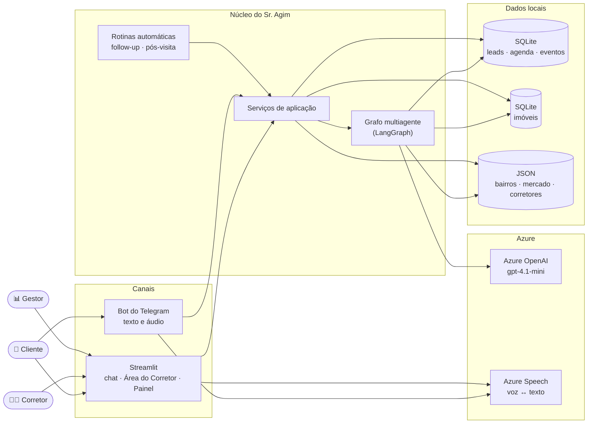

Sem chave do Azure, o projeto troca o OpenAI por um **provedor simulado (mock)** e continua funcionando. É assim que os testes rodam sem internet.

---

## 2. Camadas (Clean Architecture)

O código está dividido em cinco camadas. A regra de ouro: **as setas de dependência apontam para dentro**. O domínio não conhece banco, Azure, Telegram nem Streamlit; quem conhece esses detalhes é a infraestrutura, que *implementa* as interfaces do domínio.

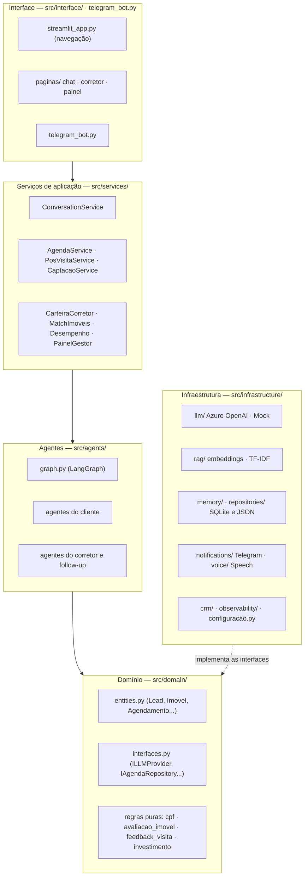

**Por que isso importa na prática?**

- **Testável:** os 240 testes trocam o Azure pelo `MockLLMProvider` e o banco real por bancos temporários, sem mudar uma linha dos agentes.
- **Trocável:** o `IPropertyRepository` tem duas implementações (`SqlitePropertyRepository` e `JsonPropertyRepository`). Trocar uma pela outra não mexe em nada acima. Esse é o Open/Closed e o Liskov aplicados de verdade.
- **Regra de negócio fora do LLM:** validar CPF, estimar o valor de um imóvel e classificar o feedback de uma visita são funções puras no domínio, testadas com casos exatos.

### Os princípios SOLID no projeto

O detalhamento de cada princípio, com arquivos, classes e trechos reais do código, está em [SOLID.md](SOLID.md).

| Princípio | Onde aparece |
|---|---|
| **S** — responsabilidade única | Um agente por tarefa (identificar, qualificar, agendar...); um serviço por caso de uso |
| **O** — aberto/fechado | Novo agente = novo nó no grafo; nova fonte de configuração = nova classe `FonteConfiguracao` |
| **L** — substituição de Liskov | `MockLLMProvider` ↔ `AzureOpenAIProvider`; `JsonPropertyRepository` ↔ `SqlitePropertyRepository` |
| **I** — segregação de interfaces | Interfaces pequenas: `IVectorSearch` só busca; `INotifier` só envia; `IVoiceService` só fala e ouve |
| **D** — inversão de dependência | Agentes recebem interfaces no construtor; quem decide a implementação é o `container.py` |

---

## 3. Como as peças são montadas (composition root)

Ninguém dá `new` em dependência dentro de agente. Tudo é montado **num único lugar**, o `src/container.py`, que lê a configuração, escolhe as implementações e entrega cada objeto pronto para quem precisa.

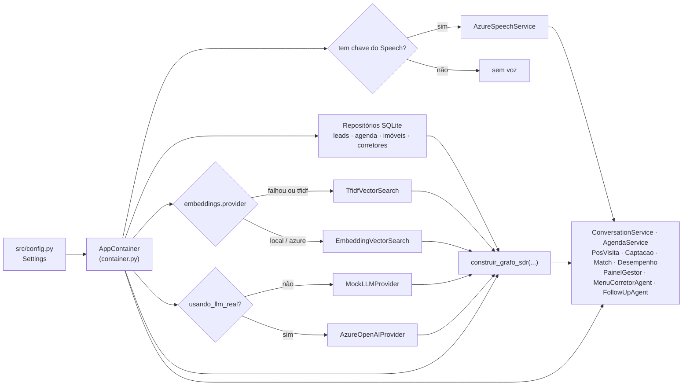

O Streamlit e o bot do Telegram só fazem `obter_container()` e usam os serviços. Ao subir, os dois mostram qual LLM está ativo (Azure ou Mock) e se a voz está ligada.

---

## 4. O caminho de uma mensagem

Este é o fluxo de uma rodada de conversa, do clique em "enviar" até a resposta na tela.

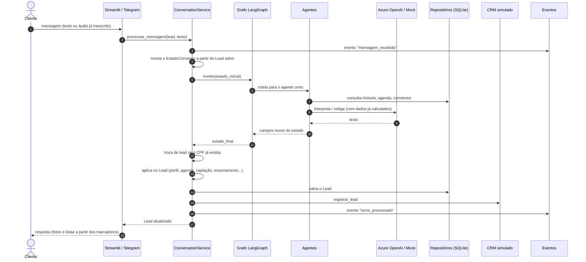

Dois detalhes desse fluxo:

- **O estado do grafo é descartável.** Ele vive só durante uma rodada. A memória de verdade é o `Lead` salvo no SQLite, e o estado é reconstruído a cada mensagem. Por isso nada se perde se o programa reiniciar.
- **Marcadores invisíveis.** O agente pode deixar na resposta marcadores como `[[FOTOS:...]]`, `[[LISTA:...]]` ou `[[AGENDA:...]]`. A interface os troca por fotos, cartões e listas, e o `src/domain/midia.py` os remove antes de mostrar o texto ou mandar para o LLM.

---

## 5. O grafo multiagente (LangGraph)

### Por que vários agentes e não um prompt gigante?

Um SDR de verdade faz várias coisas diferentes: descobre quem é o cliente, entende o que ele quer, mostra imóveis, agenda, passa o bastão para o corretor. Separar cada tarefa num agente dá:

- **prompts curtos e focados**, mais fáceis de testar e corrigir;
- **controle de fluxo explícito**: quem decide o próximo passo são funções Python legíveis (`_rotear_entrada`, `_rotear_apos_qualificacao`...), não o LLM;
- **extensão sem efeito cascata**: um agente novo é um nó e uma aresta.

### O grafo real (11 nós)

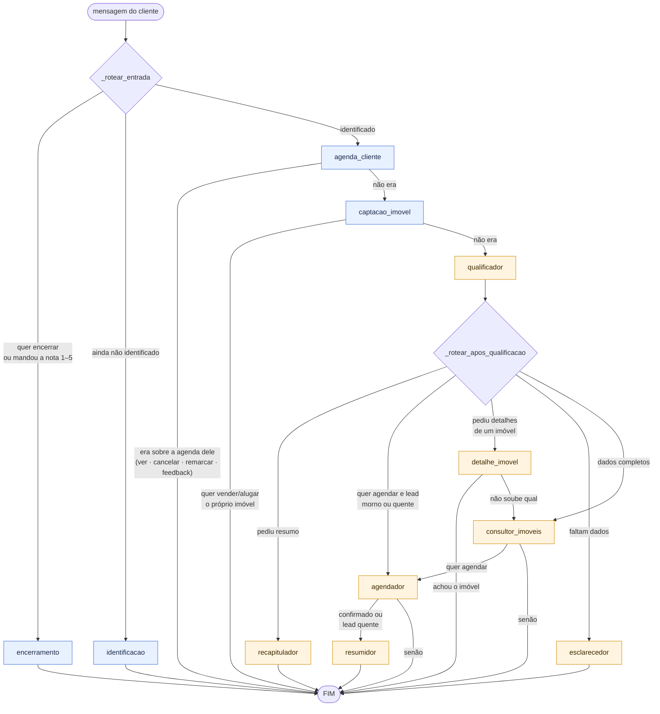

<sub>🟦 azul = determinístico (regras em Python, sem LLM decidindo) · 🟧 laranja = usa o LLM para interpretar ou redigir</sub>

Os nós de **entrada** (encerramento, identificação, agenda do cliente e captação) mexem em dados sensíveis: CPF, compromissos marcados, cadastro do imóvel. Por isso são determinísticos e não podem "alucinar". Os nós de **conversa** usam o LLM, mas sempre a partir de dados que o Python já buscou e calculou.

### O estado compartilhado

Todos os agentes trabalham sobre um único `EstadoConversa` (`src/agents/state.py`), uma espécie de prancheta que passa de mão em mão. Cada agente lê o que precisa e devolve só o que descobriu; o LangGraph junta essas partes no estado.

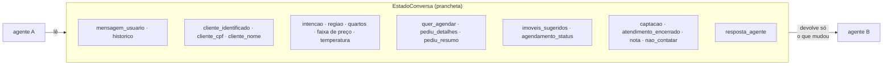

> **Cuidado conhecido:** versões novas do LangGraph proíbem um nó com o mesmo nome de uma chave do estado. Por isso o nó se chama `captacao_imovel` (a chave é `captacao`). O teste `tests/test_grafo_nomes.py` impede que isso volte.

### O princípio que guia tudo: o Python decide, o LLM conversa

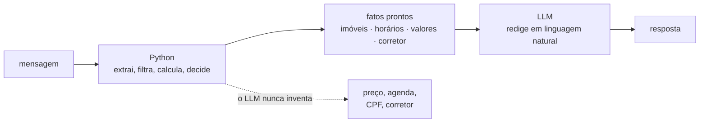

---

## 6. Fluxos do cliente

### 6.1 Identificação (nome + CPF)

O `IdentificacaoAgent` é uma pequena máquina de estados, sem LLM. O CPF passa pela validação oficial dos dígitos (`src/domain/cpf.py`). Se o CPF já existe, o cliente recupera todo o histórico e vê na hora as visitas que já tem marcadas, com o nome de cada corretor.

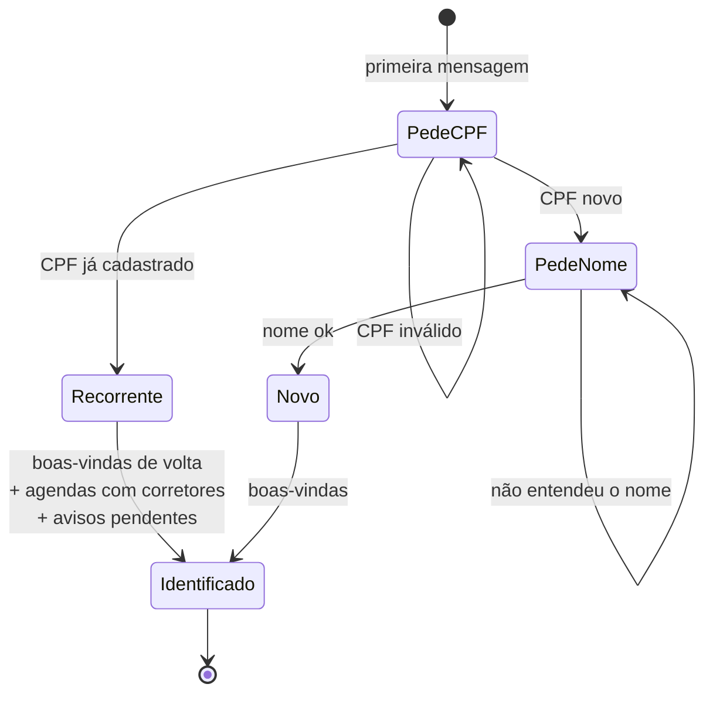

Quando o cliente é recorrente, a troca de lead acontece no serviço, não no grafo: `ConversationService._resolver_lead_alvo` passa a usar o lead antigo, com todo o histórico, no lugar do lead temporário daquela sessão.

### 6.2 Busca de imóveis: SQL primeiro, RAG como rede de segurança

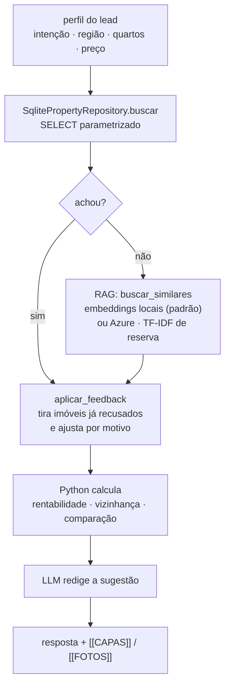

A busca estruturada é rápida e previsível; o RAG entra quando o pedido é mais livre ("algo aconchegante perto de um parque"). Se o cliente já visitou e não gostou porque "era caro", a próxima busca já vem filtrada por preço menor. Isso é o `aplicar_feedback`, do `src/domain/feedback_visita.py`.

### 6.3 Agendamento: qual corretor vai?

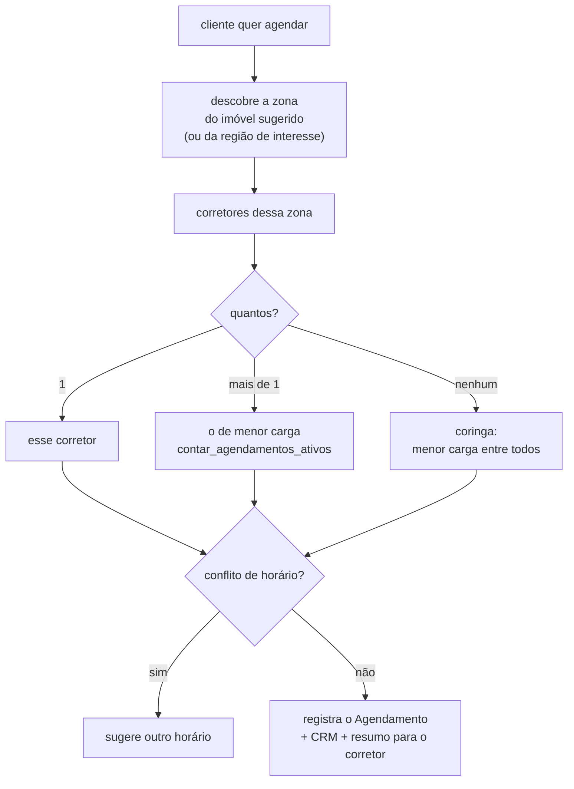

### 6.4 Ciclo de vida de um agendamento

Um agendamento pode ser **reunião**, **visita** ou **avaliação** (captação). O cliente pode ver, cancelar (com confirmação) e remarcar; o corretor também. Quem não fez a alteração é avisado.

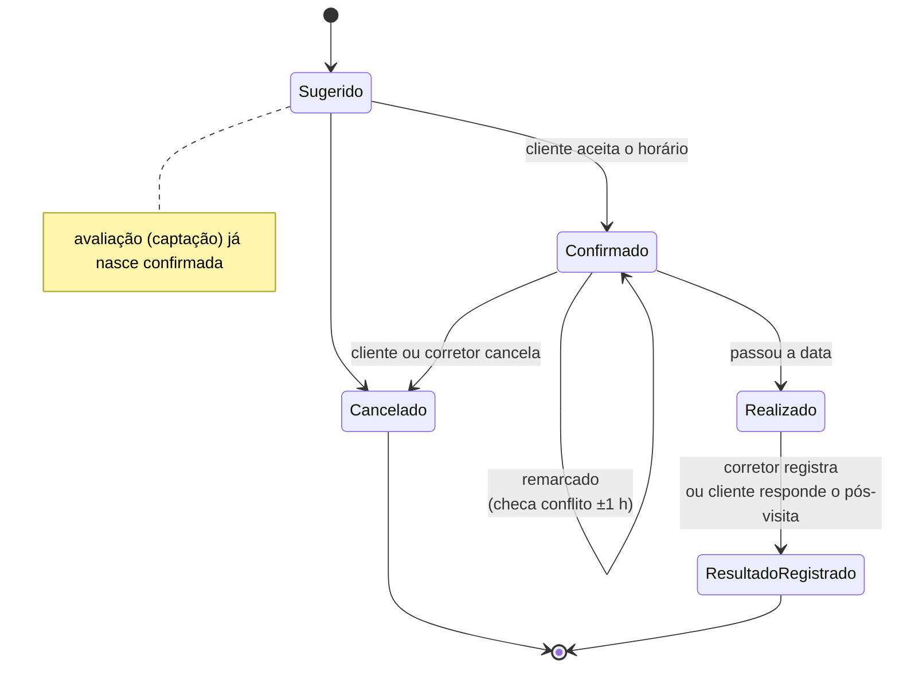

### 6.5 Avisos entre cliente e corretor

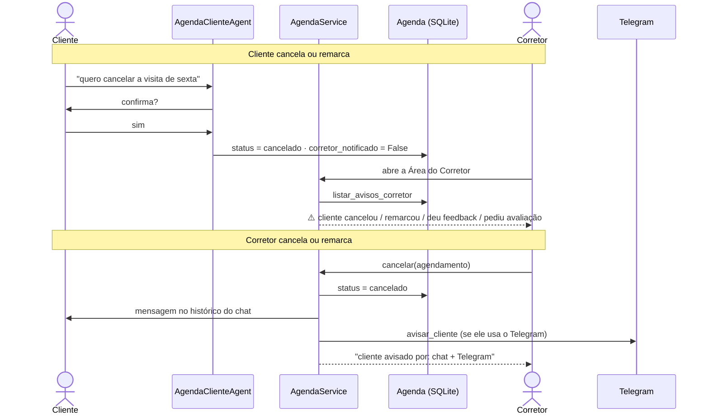

### 6.6 Captação: o cliente quer vender ou alugar o próprio imóvel

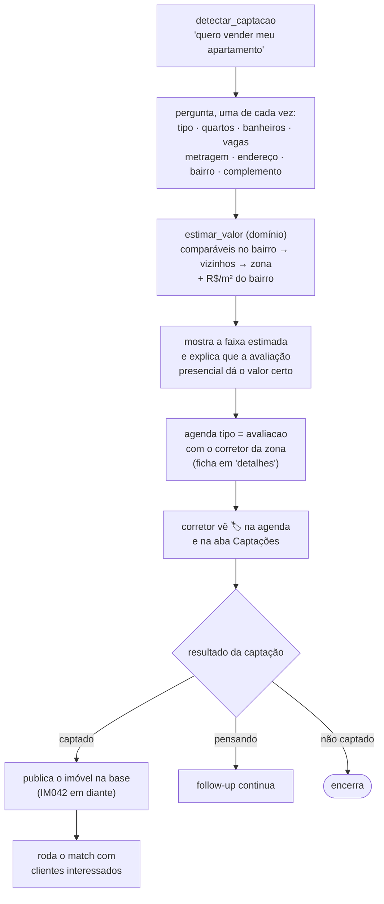

### 6.7 Encerramento do atendimento

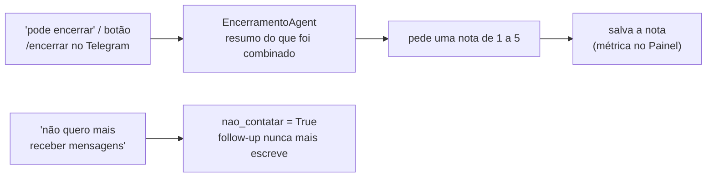

---

## 7. Fluxos do corretor

O corretor não passa pelo grafo do cliente. Ele tem uma tela própria com 7 abas e um chat com um menu numerado (`MenuCorretorAgent`). Os dados vêm dos serviços; o LLM só redige.

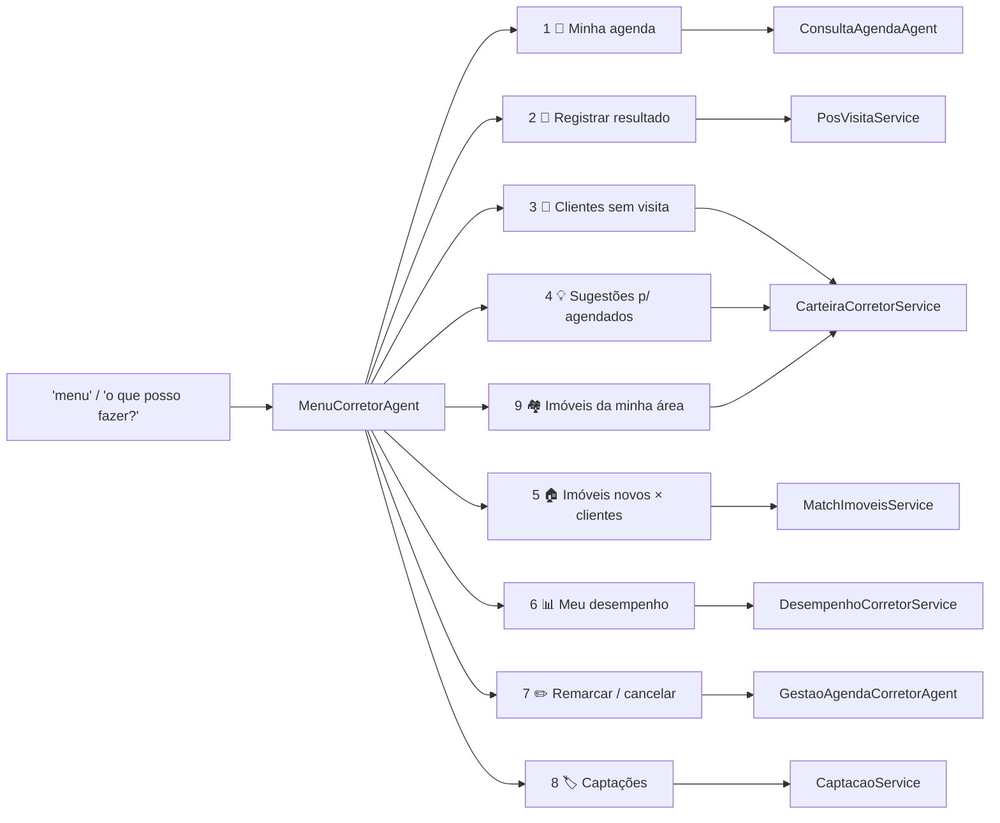

### 7.1 Do primeiro contato ao negócio fechado (funil)

O resultado da visita é o que alimenta o desempenho do corretor e o Painel do gestor.

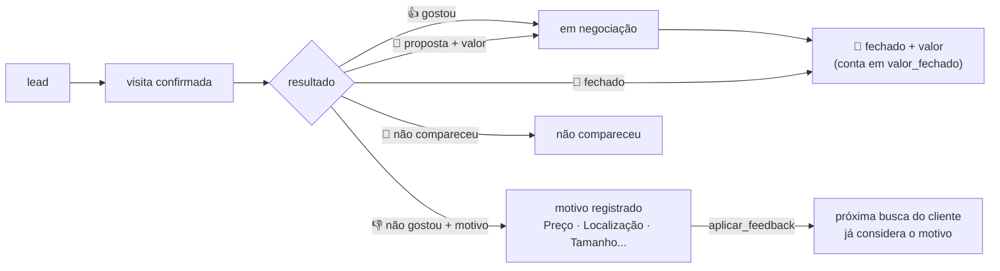

### 7.2 Imóvel novo encontra cliente (match)

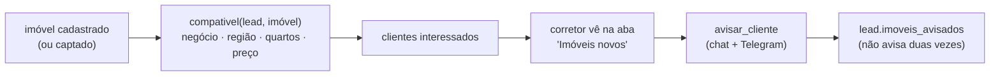

### 7.3 Painel do gestor

O `PainelGestorService.calcular(periodo_dias)` junta leads, agenda e eventos e devolve tudo pronto para as abas.

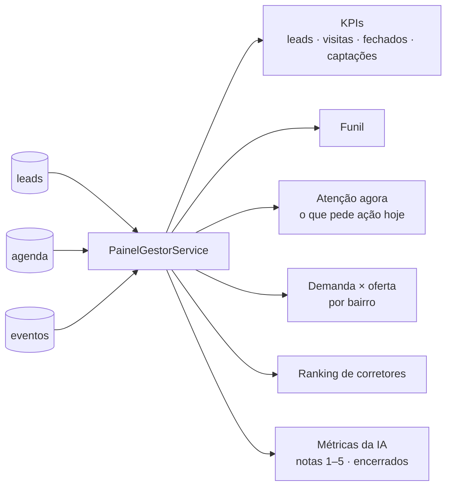

---

## 8. Rotinas automáticas

As rotinas rodam **dentro do bot do Telegram** (primeira verificação cerca de 20 s depois de subir; depois no intervalo configurado). Sem o bot, dá para disparar à mão com `python scripts/executar_followup.py` ou pelos comandos `/followup` e `/posvisita`.

### 8.1 Follow-up: quem recebe mensagem?

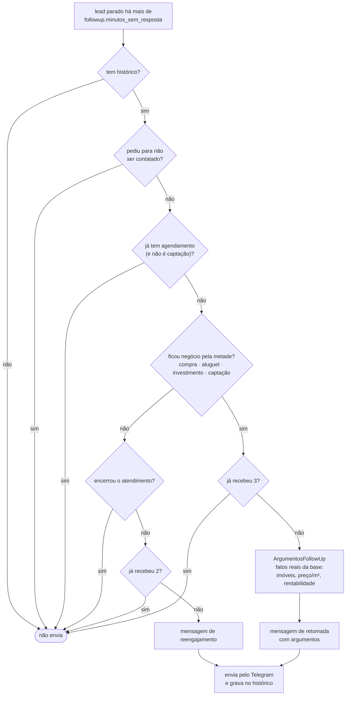

Mesmo que o cliente tenha encerrado a conversa, se ficou um negócio pela metade o Sr. Agim volta a procurá-lo, até 3 vezes, com argumentos tirados da base. Os fatos vêm do Python, e o LLM só os transforma numa mensagem convincente. O pedido de "não me mande mais mensagens" é sempre respeitado.

### 8.2 Pós-visita

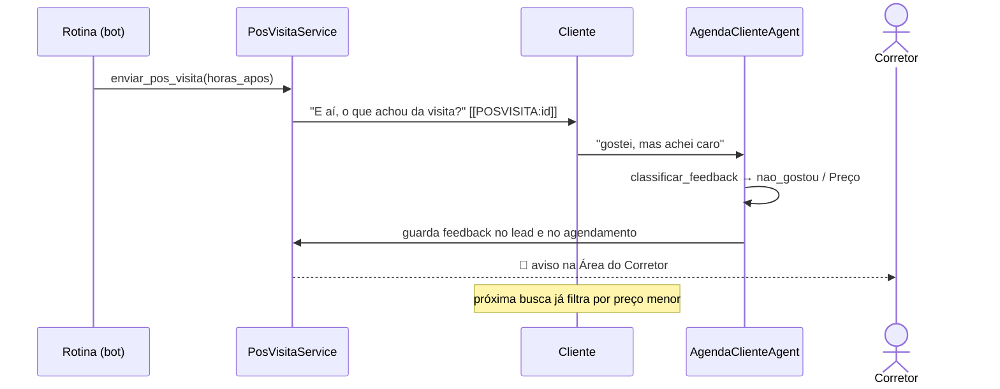

---

## 9. Voz (Azure Speech)

A voz usa a **API REST** do Azure Speech (sem SDK nativo, que dava problema de instalação no Windows). Funciona no Telegram (mensagem de áudio) e no navegador (gravador do Streamlit).

```mermaid
sequenceDiagram
    actor C as Cliente
    participant UI as Telegram / Streamlit
    participant V as AzureSpeechService
    participant CS as ConversationService

    C->>UI: áudio (OGG no Telegram, WAV no navegador)
    UI->>V: fala_para_texto (WAV convertido p/ 16 kHz mono)
    V-->>UI: texto
    UI-->>C: 🎤 Entendi: "..."
    UI->>CS: processar_mensagem(texto)
    CS-->>UI: resposta
    UI-->>C: resposta em texto
    opt azure_speech.responder_em_audio = true
        UI->>V: texto_para_fala (pt-BR-AntonioNeural)
        V-->>UI: áudio
        UI-->>C: resposta falada
    end
```

Se algo falhar (chave, região, formato), `explicar_erro_de_voz` mostra o motivo em português e o cliente é convidado a escrever.

---

## 10. Dados e memória

```mermaid
erDiagram
    LEAD ||--o{ MENSAGEM : "histórico"
    LEAD ||--o{ AGENDAMENTO : "marca"
    CORRETOR ||--o{ AGENDAMENTO : "atende"
    IMOVEL ||--o{ AGENDAMENTO : "visitado em"
    CORRETOR }o--o{ ZONA : "atua em"
    IMOVEL }o--|| BAIRRO : "fica em"
    BAIRRO }o--|| ZONA : "pertence a"

    LEAD {
        string id
        string cpf
        string nome
        json perfil
        string temperatura
        json feedback_visitas
        json captacao
        bool atendimento_encerrado
        bool nao_contatar
    }
    AGENDAMENTO {
        string id
        string tipo "reuniao | visita | avaliacao"
        string status "sugerido | confirmado | cancelado"
        datetime data_hora
        string resultado_visita
        float valor_negociado
        string detalhes
    }
    IMOVEL {
        string id
        string tipo_negocio
        string bairro
        int quartos
        float preco
        float metragem
    }
    CORRETOR {
        string id
        string nome
        list zonas_atuacao
    }
```

| Onde | O que guarda |
|---|---|
| `data/agente_sdr.db` | leads (com histórico), agendamentos, eventos |
| `data/imoveis.db` | 41 imóveis (criado a partir de `imoveis.json` na primeira execução) |
| `data/corretores.json` | 9 corretores e suas zonas |
| `data/bairros_sp.json` | 59 bairros com zona e vizinhos |
| `data/mercado_investimento.json` | indicadores para a análise de investimento |
| `data/telegram_sessoes.json` | qual chat do Telegram é de qual lead |

**Duas memórias, dois papéis:** o `Lead` no SQLite é a memória de longo prazo e sobrevive a reinícios; o `EstadoConversa` é a memória de trabalho de uma única rodada.

---

## 11. Configuração e segurança

### De onde vem cada configuração

```mermaid
flowchart LR
    a["padrão no código"] --> b["config/settings.toml<br/>vai para o Git"]
    b --> c["config/settings.local.toml<br/>só desta máquina"]
    c --> d[".env / variáveis de ambiente<br/>SÓ segredos"]
    d --> s["Settings (imutável)"]
    s --> app["resto do app<br/>from src.config import settings"]

    b -. "segredo aqui?" .-> x["❌ app se recusa a iniciar"]
    c -. "segredo aqui?" .-> x
```

O último vence. As fontes são adaptadores (`ArquivoTomlFonte`, `AmbienteFonte`) atrás do protocolo `FonteConfiguracao`; acrescentar um Azure Key Vault, por exemplo, seria só mais uma fonte.

### Cuidados de segurança

- Chaves e tokens existem **só** no `.env`, que fica fora do Git. Cada campo de `Settings` declara se é segredo; segredo não aparece em `repr` nem em log.
- Um segredo encontrado num arquivo TOML faz o app **parar na inicialização**, para não ir parar no Git por engano.
- O CPF vai mascarado nos prompts enviados ao LLM.
- O cliente pode pedir para não ser mais contatado (`nao_contatar`).
- Sem chave, o modo mock permite demonstrar e desenvolver sem expor nada.

---

## 12. Observabilidade

```mermaid
flowchart LR
    cs["ConversationService"] -- "mensagem_recebida<br/>turno_processado<br/>agendamento_cancelado_pelo_cliente" --> ev["EventoStore<br/>(SQLite + logging)"]
    ag["Agenda · Pós-visita · Captação · Match"] -- "agendamento_cancelado_pelo_corretor<br/>resultado_visita_registrado<br/>captacao_resultado · imovel_cadastrado" --> ev
    rt["Rotinas automáticas"] -- "followup_disparado<br/>pos_visita_enviado" --> ev
    ev --> painel["Painel da Imobiliária"]
    ev --> log["terminal / arquivo de log"]
```

O Painel lê os eventos direto do banco, sem precisar interpretar arquivos de log.

---

## 13. Escalabilidade e caminho para produção

A POC roda numa instância só, e isso é consciente: SQLite local, sessões do Telegram num JSON e rotinas automáticas dentro do processo do bot. Como todas essas peças estão atrás de interfaces, a evolução é localizada:

```mermaid
flowchart LR
    subgraph hoje["Hoje (POC)"]
        h1["SQLite local"]
        h2["telegram_sessoes.json"]
        h3["rotinas dentro do bot"]
        h4["CRM simulado"]
        h5["RAG em memória"]
    end
    subgraph prod["Produção (Azure)"]
        p1["Azure SQL / Cosmos DB<br/>CPF indexado"]
        p2["sessões no banco"]
        p3["Azure Functions /<br/>Container Apps Jobs"]
        p4["CRM real via API"]
        p5["Azure AI Search"]
    end
    h1 --> p1
    h2 --> p2
    h3 --> p3
    h4 --> p4
    h5 --> p5
```

- A interface é *stateless*: todo o estado fica em `data/`. Com um banco gerenciado, dá para rodar várias réplicas atrás de um balanceador.
- `Dockerfile` e `docker-compose.yml` já permitem publicar em Azure Container Apps, App Service for Containers ou AKS.

---

## 14. Mapa de componentes

| Componente | O que faz | Usa LLM? |
|---|---|---|
| `IdentificacaoAgent` | Cadastra ou reconhece o cliente (nome + CPF) e mostra as agendas dele | não |
| `EncerramentoAgent` | Encerra o atendimento, pede a nota de 1 a 5, registra o opt-out | não |
| `AgendaClienteAgent` | Cliente vê, cancela e remarca; captura o feedback do pós-visita | não |
| `CaptacaoImovelAgent` | Cadastro do imóvel do cliente, estimativa de valor e avaliação agendada | não |
| `QualificadorAgent` | Extrai os dados da mensagem e classifica a temperatura do lead | sim |
| `EsclarecedorAgent` | Pergunta, com naturalidade, o que ainda falta | sim |
| `ConsultorImoveisAgent` | Busca (SQL + RAG) e apresenta imóveis e análise de investimento | sim |
| `DetalheImovelAgent` | Ficha completa de um imóvel, com fotos | sim |
| `AgendadorAgent` | Escolhe corretor por zona e carga, evita conflito, registra a visita | sim |
| `ResumidorAgent` | Resumo do lead para o corretor humano | sim |
| `RecapituladorAgent` | "O que já conversamos?" | sim |
| `MenuCorretorAgent` | Menu de 9 opções do corretor | só para redigir |
| `ConsultaAgendaAgent` / `GestaoAgendaCorretorAgent` | Corretor consulta / altera a agenda pelo chat | só para redigir |
| `FollowUpAgent` + `ArgumentosFollowUp` | Reengaja leads parados; negócio pendente recebe argumentos reais | sim |
| `ConversationService` | Orquestra uma rodada: estado → grafo → lead → CRM → eventos | — |
| `AgendaService` | Cancelar/remarcar e avisos cliente ↔ corretor | — |
| `PosVisitaService` / `CaptacaoService` | Resultados de visitas e captações (funil) | — |
| `MatchImoveisService` / `CarteiraCorretorService` | Imóvel novo × clientes / carteira e imóveis da área | — |
| `DesempenhoCorretorService` / `PainelGestorService` | Funil do corretor / visão do gestor | — |
| `AzureSpeechService` | Voz ↔ texto | — |
| `AppContainer` | Monta e injeta todas as dependências | — |
