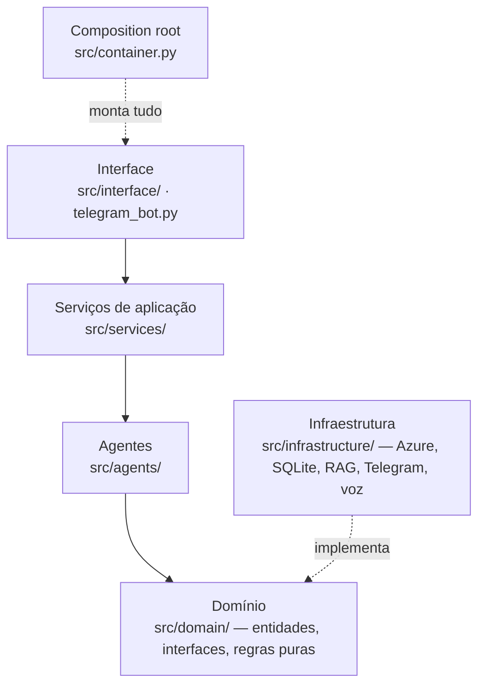
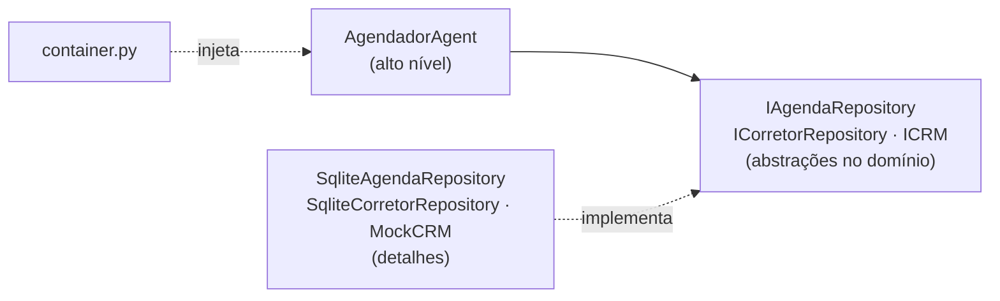

# Clean Architecture e SOLID no Sr. Agim

Este documento mostra **onde e como** os princípios SOLID e a Clean Architecture aparecem no código do Sr. Agim. Cada princípio vem com o arquivo, a classe e um trecho real do projeto, para facilitar a conferência.

Os outros documentos tratam do assunto de forma resumida: [ARQUITETURA.md](ARQUITETURA.md) traz os diagramas e [decisoes_projeto.md](decisoes_projeto.md) a decisão D01.

## Sumário

1. [Por que SOLID neste projeto](#1-por-que-solid-neste-projeto)
2. [Clean Architecture: as camadas](#2-clean-architecture-as-camadas)
3. [S — Responsabilidade única](#3-s--responsabilidade-única)
4. [O — Aberto/fechado](#4-o--abertofechado)
5. [L — Substituição de Liskov](#5-l--substituição-de-liskov)
6. [I — Segregação de interfaces](#6-i--segregação-de-interfaces)
7. [D — Inversão de dependência](#7-d--inversão-de-dependência)
8. [Exemplo prático: trocar o provedor de LLM](#8-exemplo-prático-trocar-o-provedor-de-llm)
9. [O que o SOLID trouxe na prática](#9-o-que-o-solid-trouxe-na-prática)
10. [Onde ainda dá para melhorar](#10-onde-ainda-dá-para-melhorar)

---

## 1. Por que SOLID neste projeto

Um agente de IA costuma virar um arquivo enorme que mistura prompt, banco de dados, regra de negócio e tela. O resultado é um código difícil de testar e de mudar. Trocar o provedor de LLM ou o banco, por exemplo, mexe em tudo.

O Sr. Agim foi desenhado para evitar isso. Os cinco princípios SOLID, junto com a Clean Architecture, permitiram três coisas:

- **Testar sem rede e sem custo.** Os 240 testes trocam o Azure por um LLM simulado e o banco real por bancos temporários, sem mudar uma linha dos agentes.
- **Trocar peças sem efeito cascata.** LLM, busca semântica, banco, CRM, voz e fontes de configuração ficam atrás de interfaces.
- **Crescer por adição.** Funcionalidades novas (captação, pós-visita, encerramento) entraram como agentes e serviços novos, sem reescrever os que já existiam.

---

## 2. Clean Architecture: as camadas



| Camada | Pasta | Conhece | Não conhece |
|---|---|---|---|
| Domínio | `src/domain/` | Só Python | Banco, Azure, LangGraph, Streamlit |
| Agentes | `src/agents/` | Domínio (interfaces) | Qual banco ou qual LLM está por trás |
| Serviços | `src/services/` | Domínio e agentes | Telas e canais |
| Infraestrutura | `src/infrastructure/` | Domínio (para implementar as interfaces) | Agentes e telas |
| Interface | `src/interface/`, `telegram_bot.py` | Serviços | Detalhes de banco e de LLM |

**A regra de dependência:** as setas apontam para dentro. O domínio é o centro e não importa nada de fora.

---

## 3. S — Responsabilidade única

> *Uma classe deve ter um único motivo para mudar.*

**No projeto:** cada agente cuida de uma etapa do atendimento, e cada serviço de um caso de uso.

| Classe | Arquivo | Única responsabilidade |
|---|---|---|
| `IdentificacaoAgent` | `src/agents/identification_agent.py` | Cadastrar ou reconhecer o cliente pelo CPF |
| `QualificadorAgent` | `src/agents/qualifier_agent.py` | Extrair dados da mensagem e classificar o lead |
| `EsclarecedorAgent` | `src/agents/clarifier_agent.py` | Perguntar o que ainda falta |
| `ConsultorImoveisAgent` | `src/agents/property_agent.py` | Buscar e apresentar imóveis |
| `AgendadorAgent` | `src/agents/scheduler_agent.py` | Escolher corretor e registrar a visita |
| `CaptacaoImovelAgent` | `src/agents/captacao_agent.py` | Cadastro do imóvel do proprietário |
| `EncerramentoAgent` | `src/agents/encerramento_agent.py` | Encerrar o atendimento e pedir a nota |
| `ConversationService` | `src/services/conversation_service.py` | Orquestrar uma rodada de conversa |
| `AgendaService` | `src/services/agenda_service.py` | Cancelar, remarcar e avisar as partes |
| `PainelGestorService` | `src/services/painel_gestor_service.py` | Calcular os números do Painel |

**Regras de negócio puras** também ficam isoladas, cada uma em seu módulo de domínio:

| Módulo | Faz só isto |
|---|---|
| `src/domain/cpf.py` | Validar o CPF pelo algoritmo oficial |
| `src/domain/avaliacao_imovel.py` | Estimar a faixa de valor de um imóvel captado |
| `src/domain/feedback_visita.py` | Classificar o motivo de perda de uma visita |
| `src/domain/investimento.py` | Calcular rentabilidade e comparar com Selic/CDI |
| `src/domain/midia.py` | Remover os marcadores internos das mensagens |

**A configuração também segue o princípio.** `Settings` (`src/config.py`) só guarda os valores. Quem lê arquivos e variáveis de ambiente são as fontes (`src/infrastructure/configuracao.py`).

**A interface segue o mesmo raciocínio.** `streamlit_app.py` só faz a navegação, e cada tela tem seu arquivo em `src/interface/paginas/`.

---

## 4. O — Aberto/fechado

> *Aberto para extensão, fechado para modificação.*

**No projeto, para estender basta acrescentar.**

**Um agente novo é um nó novo no grafo.** Foi assim que entraram a captação, a agenda do cliente e o encerramento, sem alterar os agentes existentes (`src/agents/graph.py`):

```python
grafo.add_node("encerramento", EncerramentoAgent(agenda_repository))
grafo.add_node("agenda_cliente", AgendaClienteAgent(agenda_repository, corretor_repository, crm, repositorio_imoveis))
grafo.add_node("captacao_imovel", CaptacaoImovelAgent(...))
```

**Uma fonte de configuração nova é uma classe nova.** Qualquer classe com `nome` e `ler()` serve (`src/infrastructure/configuracao.py`). Um Azure Key Vault, por exemplo, entraria sem mudar `Settings`:

```python
class FonteConfiguracao(Protocol):
    nome: str

    def ler(self) -> dict[str, Any]:
        """Valores encontrados, com chaves no formato "secao.chave"."""
        ...
```

**Um provedor de embeddings novo também é uma classe nova.** Basta implementar o protocolo `IEmbedder` (`src/infrastructure/rag/embedding_search.py`). Hoje existem `SentenceTransformerEmbedder` (local) e `AzureOpenAIEmbedder`.

---

## 5. L — Substituição de Liskov

> *Uma implementação pode ocupar o lugar de outra sem que quem a usa perceba.*

**No projeto:** cada interface do domínio tem implementações intercambiáveis.

| Interface | Implementações | Onde se troca |
|---|---|---|
| `ILLMProvider` | `AzureOpenAIProvider`, `MockLLMProvider` | `llm.provider` em `config/settings.toml` |
| `IPropertyRepository` | `SqlitePropertyRepository`, `JsonPropertyRepository` | `src/container.py` |
| `IVectorSearch` | `EmbeddingVectorSearch`, `TfidfVectorSearch` | `embeddings.provider` |
| `IEmbedder` | `SentenceTransformerEmbedder`, `AzureOpenAIEmbedder` | `embeddings.provider` |
| `FonteConfiguracao` | `ArquivoTomlFonte`, `AmbienteFonte` | `fontes_padrao()` em `src/config.py` |

**A prova prática** é que os 240 testes rodam os mesmos agentes com o `MockLLMProvider` no lugar do Azure. Os agentes não sabem qual dos dois está por trás.

**Substituição em tempo de execução:** o `EmbeddingVectorSearch` recebe o `TfidfVectorSearch` como reserva. Se os embeddings falharem, o TF-IDF assume no mesmo lugar, e quem pediu a busca não percebe a troca.

---

## 6. I — Segregação de interfaces

> *Ninguém deve depender de métodos que não usa.*

**No projeto:** as interfaces são pequenas e focadas (`src/domain/interfaces.py`).

| Interface | Métodos | Quem usa |
|---|---|---|
| `IVectorSearch` | `buscar_similares` | Consultor de imóveis |
| `INotifier` | `enviar` | Avisos pelo Telegram |
| `IVoiceService` | `texto_para_fala`, `fala_para_texto` | Bot e chat web |
| `IMarketDataRepository` | `obter_indicadores` | Análise de investimento e captação |
| `ICRM` | `registrar_lead`, `registrar_resumo`, `registrar_agendamento` | Serviço de conversa e agendador |
| `IObservador` | `registrar_evento` | Serviço de conversa e rotinas |
| `ILLMProvider` | `gerar_resposta`, `extrair_dados_estruturados` | Agentes de conversa |

```python
class IVectorSearch(ABC):
    """Contrato para a busca semântica (RAG) sobre os imóveis."""

    @abstractmethod
    def buscar_similares(self, consulta: str, top_k: int = 3) -> list[Imovel]:
        raise NotImplementedError
```

**Repositórios separados por assunto.** Leads (`ILeadRepository`), agenda (`IAgendaRepository`), corretores (`ICorretorRepository`) e imóveis (`IPropertyRepository`) ficam em interfaces diferentes. O agente de captação, por exemplo, não depende de nada do repositório de leads que não use.

**`IObservador` é um `Protocol`.** Qualquer objeto com `registrar_evento(nome, dados)` serve, sem precisar herdar de nada.

---

## 7. D — Inversão de dependência

> *Módulos de alto nível não dependem de detalhes; os dois dependem de abstrações.*

**No projeto:** agentes e serviços recebem **interfaces** no construtor e nunca criam suas dependências.

```python
class ConversationService:
    def __init__(
        self,
        grafo_compilado,
        lead_repository: ILeadRepository,
        crm: ICRM,
        observador: IObservador,
        resumidor=None,
    ) -> None:
```

**Quem decide as implementações concretas é um único lugar**, o composition root `src/container.py`:

```python
llm_provider = criar_llm_provider(settings)
repositorio_imoveis = SqlitePropertyRepository(...)
busca_semantica = criar_busca_semantica(repositorio_imoveis, mapa_bairros)
lead_repository = SqliteLeadRepository(settings.database_path)
agenda_repository = SqliteAgendaRepository(caminho_db=settings.database_path)

grafo = construir_grafo_sdr(
    llm_provider=llm_provider,
    repositorio_imoveis=repositorio_imoveis,
    busca_semantica=busca_semantica,
    ...
)
```



**Fábricas como ponto único de decisão:**

- `criar_llm_provider` decide entre Azure e Mock;
- `criar_busca_semantica` decide entre embeddings e TF-IDF;
- `criar_servico_de_voz` decide se há voz.

---

## 8. Exemplo prático: trocar o provedor de LLM

Para usar outro modelo, como um Gemini ou um modelo local:

1. Criar `src/infrastructure/llm/gemini_provider.py` com uma classe que herda de `ILLMProvider` e implementa `gerar_resposta` e `extrair_dados_estruturados`.
2. Acrescentar uma linha em `criar_llm_provider` (`src/infrastructure/llm/factory.py`) para escolhê-la quando `llm.provider = "gemini"`.
3. Nenhum agente, serviço ou tela muda. Os testes continuam valendo.

O mesmo vale para trocar o SQLite por Azure SQL (nova classe de `IAgendaRepository`) ou o CRM simulado por um CRM real (nova classe de `ICRM`).

---

## 9. O que o SOLID trouxe na prática

| Situação real no projeto | Princípio que ajudou |
|---|---|
| Testar tudo sem chave do Azure | L e D: `MockLLMProvider` no lugar do Azure |
| Embeddings locais falharam numa máquina e o TF-IDF assumiu | L: `TfidfVectorSearch` como reserva |
| Captação, encerramento e agenda do cliente entraram sem reescrever o grafo | O: novos nós |
| `.env` com segredos separado do `settings.toml` | S e O: `Settings` × fontes |
| Testes da interface com bancos temporários | D: container recebe a configuração |
| Interface dividida em uma tela por arquivo | S |

---

## 10. Onde ainda dá para melhorar

Para ser honesto com a avaliação, há pontos em que o projeto ainda não segue o SOLID à risca:

- `MockCRM()` é criado com o caminho padrão no container. O ideal seria receber o caminho da configuração, como os bancos SQLite.
- `criar_busca_semantica` lê a configuração global em vez de recebê-la do container, como já faz `criar_llm_provider`.
- Alguns arquivos cresceram além do ideal: `src/interface/paginas/corretor.py` (cerca de 520 linhas) e `src/agents/qualifier_agent.py` (cerca de 500). Daria para dividir por aba e por tipo de extração.
- Algumas regras de reconhecimento de intenção (padrões de texto) ainda ficam dentro dos agentes. Poderiam ir para módulos de domínio próprios.

São melhorias localizadas: nenhuma exige mudar a arquitetura.
