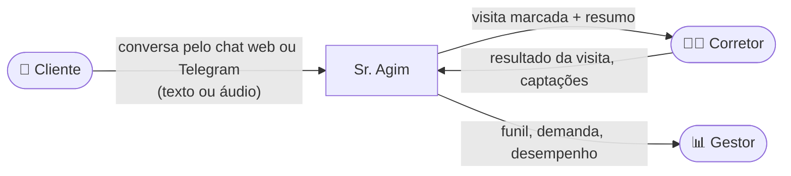

# Contexto do Projeto — Sr. Agim, o Agente SDR Imobiliário

> FIAP · Pós-graduação em IA · Tech Challenge — Fase 5 (Hackathon)
> Prova de Conceito (POC) de um Agente SDR Imobiliário com IA Generativa

Este documento explica **de onde o projeto nasceu**: o problema que ele ataca, para quem foi feito, o que o desafio pedia e até onde decidimos ir. As decisões técnicas estão em [`decisoes_projeto.md`](decisoes_projeto.md) e os resultados em [`relatorio_tecnico.md`](relatorio_tecnico.md).

---

## 1. O desafio

O mercado imobiliário está passando por uma transformação puxada por inteligência artificial, automação e atendimento conversacional. O Hackathon da Fase 5 propôs construir uma **POC de um Agente SDR Imobiliário** usando IA Generativa.

SDR (*Sales Development Representative*) é quem faz o primeiro contato com o cliente: atende, entende o que ele procura, separa quem está pronto para comprar de quem só está curioso e entrega ao corretor uma oportunidade já organizada.

### O que o enunciado pede que o agente faça

| # | Objetivo |
|---|---|
| 1 | Atender leads automaticamente |
| 2 | Conversar de forma humanizada |
| 3 | Qualificar clientes |
| 4 | Identificar a intenção: compra, aluguel ou investimento |
| 5 | Coletar as informações relevantes |
| 6 | Fazer follow-up automático |
| 7 | Agendar reuniões ou visitas |
| 8 | Integrar com uma base simulada de imóveis |
| 9 | Gerar resumos para os corretores |

### Os três cenários de referência

1. **Compra:** "Estou procurando apartamento na zona sul." O agente descobre quartos, faixa de preço, região e urgência, sugere imóveis e agenda a visita.
2. **Investimento:** "Quero investir em imóveis para renda." O agente identifica o perfil investidor, entende o valor disponível e a expectativa de retorno e encaminha para um especialista.
3. **Follow-up:** o cliente para de responder. O agente retoma o contato no ponto em que a conversa parou.

### Como o trabalho é avaliado

| Critério | O que se olha |
|---|---|
| Arquitetura | Organização, escalabilidade, componentização |
| Inteligência Artificial | Qualidade das respostas, humanização, contexto conversacional |
| Experiência do usuário | Interface, clareza, usabilidade |
| Inovação | Criatividade, diferenciais técnicos |

Diferenciais sugeridos pelo enunciado: RAG, Telegram, memória conversacional, multiagentes, Voice AI, CRM simulado, observabilidade, segurança e deploy em nuvem.

---

## 2. O problema de negócio

Toda imobiliária conhece esta cena: o anúncio gera contatos, mas boa parte deles **esfria antes de alguém responder**. Os motivos se repetem:

- **Demora na resposta.** O cliente manda mensagem à noite ou no fim de semana e só recebe retorno no dia seguinte, quando já falou com outras três imobiliárias.
- **Falta de acompanhamento.** Quem parou de responder raramente recebe um segundo contato.
- **Corretor sobrecarregado com triagem.** Boa parte do dia vai para perguntas repetidas ("qual bairro?", "quantos quartos?", "até quanto?") em vez de visitas e negociação.
- **Informação que se perde.** O que o cliente contou no WhatsApp não chega organizado a quem vai atendê-lo na visita.
- **Sem visão do funil.** O gestor não sabe com clareza quantos contatos viraram visita, quantas visitas viraram proposta e onde está faltando imóvel para a demanda que chega.

A proposta do Sr. Agim é **cuidar da parte repetitiva do atendimento, 24 horas por dia**, e entregar ao corretor humano o cliente já qualificado, com visita marcada e um resumo pronto. O corretor entra onde faz diferença: na visita e no fechamento.

---

## 3. Para quem o sistema foi feito

| Público | O que ele quer | O que o Sr. Agim entrega |
|---|---|---|
| **Cliente que procura imóvel** (compra ou aluguel) | Resposta rápida, opções que caibam no bolso, visita sem burocracia | Atendimento imediato, lista de imóveis da base, fotos, visita agendada com o corretor da região, poder remarcar e cancelar pelo chat |
| **Investidor** | Saber se o imóvel rende mais do que deixar o dinheiro aplicado | Retorno estimado com dados de mercado (FipeZAP, Selic, CDI) e encaminhamento para o especialista em investimentos |
| **Proprietário** (quer vender ou alugar o próprio imóvel) | Saber quanto vale e ter alguém para cuidar da venda | Cadastro rápido, faixa de valor estimada a partir de imóveis parecidos e avaliação presencial agendada |
| **Corretor** | Tempo para visitar e negociar, clientes bem qualificados | Agenda organizada, resumo de cada cliente, clientes da área que ainda não visitaram, sugestões de imóveis, registro do resultado das visitas, seu próprio funil |
| **Gestor da imobiliária** | Saber o que está acontecendo e onde agir | Painel com funil, ranking de corretores, demanda × oferta por bairro, satisfação dos clientes e itens que pedem atenção |

---

## 4. Escopo

### O que a POC cobre

- Atendimento conversacional completo pelo navegador (Streamlit) e pelo Telegram, com texto e voz.
- Cadastro e reconhecimento do cliente pelo CPF, com memória entre conversas e entre canais.
- Qualificação (intenção, região, quartos, orçamento, urgência; ticket e retorno esperado para investidores).
- Busca na base de imóveis (SQL + RAG) e análise de investimento.
- Agendamento com escolha automática do corretor pela zona e pela carga de trabalho.
- Cliente consulta, remarca e cancela as próprias visitas; corretor e cliente se avisam mutuamente.
- Follow-up automático e pós-visita.
- Captação de imóveis de proprietários, com estimativa de valor.
- Área do Corretor (7 abas + assistente com menu) e Painel da Imobiliária.
- Encerramento do atendimento com nota de satisfação e opção de não ser mais contatado.

### O que ficou fora (de propósito)

- **Integrações reais** com CRM, portais imobiliários ou WhatsApp Business. O CRM é simulado e o canal móvel é o Telegram.
- **Login e permissões.** Na Área do Corretor, o corretor escolhe o próprio nome numa lista.
- **Escala de produção.** SQLite local e rotinas dentro do processo do bot, para uma instância só.
- **Base real de imóveis.** São 41 imóveis fictícios em São Paulo, com fotos ilustrativas.
- **Identidade visual própria** da imobiliária. A interface usa o visual padrão do Streamlit.

---

## 5. Premissas e restrições

- **Cidade de referência:** São Paulo, com 59 bairros mapeados por zona e vizinhança.
- **Equipe fictícia:** 9 corretores, cada um atendendo uma ou mais zonas, e um especialista em investimentos.
- **Custo zero para avaliar:** o projeto precisa rodar sem nenhuma chave, porque o avaliador pode clonar o repositório e testar. Para isso existe o modo simulado (mock) do LLM.
- **IA de verdade na demonstração:** Azure OpenAI (`gpt-4.1-mini`) e Azure Speech, os dois na região East US.
- **Segredos fora do Git:** chaves e tokens só no `.env`.
- **Idioma:** todo o atendimento e o código de domínio estão em português, para ficar fiel ao negócio.

---

## 6. Glossário

| Termo | Significado aqui |
|---|---|
| **SDR** | Quem faz o primeiro atendimento e qualifica o cliente antes de passar ao corretor |
| **Lead** | Pessoa que entrou em contato e ainda não fechou negócio |
| **Qualificação** | Descobrir o que o cliente quer e se ele está pronto para avançar |
| **Temperatura** | Quão perto o lead está de fechar: frio, morno ou quente |
| **Follow-up** | Nova mensagem para quem parou de responder |
| **Pós-visita** | Mensagem depois da visita perguntando o que o cliente achou |
| **Captação** | Trazer para a carteira o imóvel de um proprietário que quer vender ou alugar |
| **Avaliação** | Visita do corretor ao imóvel do proprietário para definir o preço |
| **Match** | Cruzar um imóvel novo com os clientes que procuram algo parecido |
| **Funil** | Etapas do lead até o negócio: contato → visita → proposta → fechado |
| **RAG** | Busca na base antes de responder, para o LLM usar só dados reais |
| **Mock** | Provedor de LLM simulado, usado nos testes e quando não há chave |

---

## 7. Onde está cada coisa

| Documento | Para quê |
|---|---|
| [`README.md`](../README.md) | Instalar, configurar e rodar |
| [`docs/contexto_projeto.md`](contexto_projeto.md) | Este documento: o problema e o escopo |
| [`docs/decisoes_projeto.md`](decisoes_projeto.md) | As decisões técnicas e o porquê de cada uma |
| [`docs/ARQUITETURA.md`](ARQUITETURA.md) | Camadas, agentes e fluxos em diagramas |
| [`docs/SOLID.md`](SOLID.md) | Clean Architecture e SOLID no código, princípio por princípio |
| [`docs/relatorio_tecnico.md`](relatorio_tecnico.md) | O que foi construído, como foi testado e os resultados |
| [`docs/VALIDACAO_REQUISITOS.md`](VALIDACAO_REQUISITOS.md) | Requisito por requisito, com os testes que comprovam |
