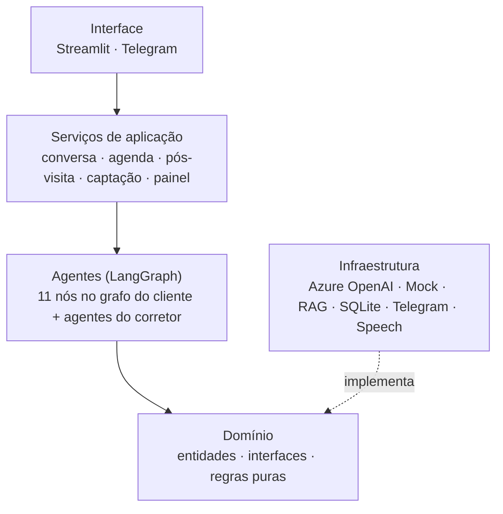

# Relatório Técnico — Sr. Agim, o Agente SDR Imobiliário

> FIAP · Pós-graduação em IA · Tech Challenge — Fase 5 (Hackathon)
> Versão de outubro/2026

## Resumo

O **Sr. Agim** é uma Prova de Conceito de um Agente SDR para imobiliárias. Ele atende o cliente pelo navegador ou pelo Telegram (texto e voz), descobre o que a pessoa procura, sugere imóveis reais da base, agenda a visita com o corretor certo e entrega ao corretor um resumo pronto. Também cuida do que costuma ficar para trás: follow-up de quem parou de responder, pós-visita, captação de imóveis de proprietários e uma visão de funil para o gestor.

Tecnicamente, é um sistema **multiagente em LangGraph** sobre **Clean Architecture**, com **Azure OpenAI (`gpt-4.1-mini`)**, **RAG com embeddings locais**, **Azure Speech** e persistência em SQLite. A regra que guia o projeto é *"o Python decide, o LLM conversa"*: preços, horários, imóveis e cálculos saem do código, e o modelo só interpreta e redige.

Os **9 objetivos** e os **3 cenários** do enunciado estão atendidos e cobertos por **240 testes automatizados**, todos passando.

---

## 1. Objetivo

Construir uma POC que mostre, funcionando de ponta a ponta, como a IA Generativa pode cuidar do primeiro atendimento de uma imobiliária sem perder o tom humano e sem inventar informação. O contexto completo do problema está em [`contexto_projeto.md`](contexto_projeto.md).

---

## 2. Tecnologias

| Camada | Tecnologia | Por quê |
|---|---|---|
| Linguagem | Python 3.11+ (desenvolvido em 3.13) | Ecossistema de IA |
| Orquestração de agentes | LangGraph 0.2 + LangChain 0.3 | Grafo de estados com roteamento explícito |
| LLM | Azure OpenAI `gpt-4.1-mini` (East US) via SDK `openai` | Qualidade em português, custo e latência baixos |
| LLM simulado | `MockLLMProvider` | Testes e uso sem chave |
| RAG | `sentence-transformers` (`paraphrase-multilingual-MiniLM-L12-v2`) + TF-IDF (scikit-learn) de reserva | Busca por significado, gratuita e local |
| Voz | Azure Speech via REST (`httpx`), voz `pt-BR-AntonioNeural` | Sem SDK nativo, funciona no Windows |
| Interface web | Streamlit 1.40 + Plotly + pandas | Chat, Área do Corretor e Painel com pouco código |
| Canal móvel | python-telegram-bot 21.9 | Texto, fotos, áudio e comandos |
| Persistência | SQLite | Zero configuração para a POC |
| Configuração | TOML + `.env` (python-dotenv) | Configuração versionada, segredos separados |
| Testes | pytest 8 + `streamlit.testing` + `httpx.MockTransport` | Sem rede, sem custo |
| Deploy | Dockerfile + docker-compose | Pronto para Azure Container Apps |

---

## 3. Arquitetura

O detalhamento, com 25 diagramas, está em [`ARQUITETURA.md`](ARQUITETURA.md). Em resumo:

- **Composition root:** `src/container.py` monta tudo e injeta as dependências.
- **Grafo do cliente:** encerramento → identificação → agenda do cliente → captação → qualificador → (esclarecedor | consultor de imóveis | detalhe | agendador → resumidor | recapitulador).
- **Corretor e gestor:** usam os mesmos serviços, fora do grafo do cliente.

As 21 decisões de projeto, com alternativas e consequências, estão em [`decisoes_projeto.md`](decisoes_projeto.md).

---

## 4. Como a IA foi aplicada

### 4.1 Divisão de trabalho entre código e LLM

| Tarefa | Quem faz | Motivo |
|---|---|---|
| Validar CPF e identificar o cliente | Python | Dado de identidade não pode ser "adivinhado" |
| Extrair intenção, região, quartos, preço e urgência | LLM (saída JSON) + regras de reforço | Linguagem livre ("uns 3 mil", "perto do metrô") |
| Decidir o próximo passo da conversa | Python (roteadores do grafo) | Fluxo previsível e testável |
| Buscar imóveis | SQL + RAG | Só oferecer o que existe |
| Calcular rentabilidade e comparar com a poupança/CDI | Python + dados de mercado (FipeZAP, Selic, CDI, IPCA) | Números exatos e com fonte |
| Estimar o valor de um imóvel captado | Python (comparáveis + R$/m² do bairro) | Faixa explicável |
| Escolher corretor e checar conflito de horário | Python | Regra de negócio |
| Redigir respostas, resumos, follow-ups e saudações | LLM | Tom humano e natural |
| Classificar o feedback da visita | Python (padrões de palavras) | Motivo rastreável |

### 4.2 Engenharia de prompt

- **Prompts curtos por agente**, cada um com papel, tom e limites claros ("não invente imóveis", "use só os fatos fornecidos").
- **Contexto montado em código:** o prompt recebe o perfil já extraído, os imóveis já filtrados e os números já calculados.
- **Histórico recente** (últimas mensagens) para manter o fio da conversa, sem os marcadores internos e com o CPF mascarado.
- **Temperatura por tarefa:** mais baixa para extração e consulta de agenda, mais alta para saudações e follow-up.
- **Follow-up de retomada:** prompt próprio que recebe argumentos verdadeiros da base (imóveis disponíveis, preço/m², rentabilidade) e pede uma mensagem persuasiva sem inventar nada.

### 4.3 RAG

1. Busca estruturada em SQL a partir do perfil (bairro pedido → vizinhos → zona).
2. Sem resultado ou com pedido vago, busca semântica por embeddings (cache em disco).
3. Os imóveis encontrados viram contexto para o LLM, que só pode citar esses.

### 4.4 Memória e contexto

- O `Lead` persistido guarda histórico, perfil, feedbacks de visita, captação, notas e preferências de contato.
- A identificação por CPF une o mesmo cliente na web e no Telegram.
- Referências como "o segundo", "fotos do 2" e "esse imóvel" são resolvidas a partir da última lista mostrada.
- O feedback de uma visita ("achei caro") muda as próximas sugestões.

### 4.5 Voz

O áudio do Telegram (OGG/Opus) e o do navegador (WAV, convertido para 16 kHz mono) viram texto no Azure Speech. A resposta pode voltar em áudio com voz neural em português.

---

## 5. Funcionalidades entregues

### Cliente

- Cadastro e reconhecimento por CPF; ao voltar, vê as visitas marcadas e com quem.
- Busca de imóveis para compra e aluguel, lista numerada com o essencial, fotos sob demanda e ficha detalhada.
- Análise de investimento com retorno estimado e encaminhamento ao especialista.
- Agendamento em linguagem natural ("sexta de manhã", "dia 8 às 13h").
- Consultar, remarcar e cancelar as próprias visitas pelo chat, com confirmação.
- Vender ou alugar o próprio imóvel: cadastro, faixa de valor e avaliação agendada.
- Encerrar o atendimento com resumo e nota de 1 a 5; pedir para não ser mais contatado.
- Áudio no Telegram e microfone no navegador.

### Corretor (Área do Corretor)

- 7 abas: Agenda, Pós-visita, Clientes, Imóveis da área, Imóveis novos, Captações e Desempenho.
- Assistente com menu de 9 opções em linguagem natural.
- Avisos quando o cliente cancela, remarca, dá feedback ou pede avaliação.
- Registro do resultado da visita (gostou, proposta com valor, fechado com valor, não gostou + motivo, não compareceu).
- Clientes da área sem visita, imóveis extras para sugerir e match de imóvel novo × clientes.

### Gestor (Painel da Imobiliária)

- KPIs, funil, "Atenção agora", demanda × oferta por bairro, ranking de corretores, métricas da IA (notas, encerramentos) e lista de leads com resumo.

### Rotinas automáticas

- Follow-up (até 2 mensagens, ou 3 com negócio pendente; respeita o opt-out).
- Pós-visita ("o que achou?") algumas horas depois da visita.

---

## 6. Qualidade e testes

| Item | Situação |
|---|---|
| Testes automatizados | **240 passando** (cerca de 20 s) |
| Arquivos de teste | 41 |
| Linhas de código | ~11 mil em `src/`, ~3,4 mil em `tests/` |
| LLM nos testes | `MockLLMProvider`, sem rede e sem custo |
| Rede nos testes | `httpx.MockTransport` para Speech e Telegram |
| Banco nos testes | Bancos SQLite temporários por teste: o banco real do app não é usado |
| Interface | Teste de fumaça com `streamlit.testing.AppTest` (as três telas abrem sem erro) |
| Chamadas reais | `scripts/diagnostico_conexao.py` e `scripts/testar_voz.py` |

**O que os testes cobrem:**

- os três cenários do enunciado, ponta a ponta;
- conversas reais reproduzidas (ex.: `test_conversa_telegram_0310.py`);
- CPF, extração de valores ("3 mil", "2500"), datas e horários;
- busca por bairro e vizinhança, RAG e análise de investimento;
- ciclo completo da agenda (criar, aceitar, remarcar, cancelar, avisos dos dois lados);
- follow-up (quem recebe, limites, opt-out, negócio pendente);
- pós-visita, match, desempenho, captação e painel;
- configuração (precedência e recusa de segredos em TOML);
- voz (formatos de áudio, erros);
- nomes do grafo (compatibilidade com versões novas do LangGraph);
- resiliência: a Área do Corretor continua abrindo com o LLM fora do ar.

---

## 7. Resultados frente ao desafio

| Objetivo do enunciado | Atendido | Destaque |
|---|---|---|
| Atender leads automaticamente | ✅ | Web e Telegram, 24 h |
| Conversa humanizada | ✅ | Persona, nome do cliente, voz, reconhecimento de quem volta |
| Qualificar clientes | ✅ | Perfil + temperatura frio/morno/quente |
| Identificar intenção | ✅ | Compra, aluguel, investimento e também captação |
| Coletar informações | ✅ | Região, quartos, orçamento, urgência; ticket e retorno |
| Follow-up automático | ✅ | Com argumentos reais e respeito ao opt-out |
| Agendar visitas | ✅ | Corretor por zona e carga; cliente remarca e cancela |
| Base simulada de imóveis | ✅ | 41 imóveis, SQL + RAG, fotos |
| Resumos para corretores | ✅ | Gerado ao confirmar a visita, visível ao corretor e ao gestor |

| Critério de avaliação | Avaliação própria | Observação |
|---|---|---|
| Arquitetura | ✅ organização e componentização · 🟡 escalabilidade | SQLite e rotinas no processo do bot servem a uma instância |
| Inteligência Artificial | ✅ | Redação real conferida na demonstração com o Azure |
| Experiência do usuário | ✅ | Visual padrão do Streamlit; sem login de corretor |
| Inovação | ✅ | Captação, match, pós-visita que realimenta a busca, demanda × oferta |

O detalhamento requisito a requisito, com o nome de cada teste, está em [`VALIDACAO_REQUISITOS.md`](VALIDACAO_REQUISITOS.md).

---

## 8. Problemas encontrados e como foram resolvidos

| Problema | Causa | Solução |
|---|---|---|
| Follow-up "não funcionava" | A rotina esperava o intervalo inteiro antes da primeira verificação | Primeira verificação ~20 s após subir, com logs no terminal |
| Sugestão de Santana para quem pediu Mooca | A busca ia direto para a zona | Bairro primeiro, depois vizinhos (com pergunta), depois a zona |
| "Quero mais fotos" virava agendamento | Ambiguidade na intenção | Pedido de fotos tratado como detalhe do imóvel mostrado |
| Erro "`captacao` is already being used as a state key" | LangGraph novo proíbe nó com nome de chave do estado | Nó renomeado para `captacao_imovel` + teste de regressão |
| "Perto do meu trabalho" virava captação | Padrão de posse muito amplo | Posse só junto de um substantivo de imóvel |
| Bot do Telegram caía com `TimedOut` ao subir | Rede lenta na conexão inicial | Retentativas, timeouts maiores e mensagem clara |
| Gravação no navegador falhava em silêncio | WAV em formatos variados (float32, EXTENSIBLE) | Leitor de WAV robusto e erro explicado na tela |
| Teste da interface usava o banco real | Conflito com o app aberto ("disk I/O error") | Bancos temporários por teste |
| Área do Corretor quebrava sem acesso ao Azure | A fábrica de LLM ignorava os settings do container, e a saudação não tinha alternativa | Fábrica recebe os settings do container; saudação padrão em Python se o LLM falhar |
| "Sim" logo depois de remarcar criava um segundo agendamento | O agendador reaproveitava o horário pedido antes sem ver que ele já estava marcado | Antes de criar, o agendador confere se o cliente já tem visita nesse dia e hora + teste de regressão |
| Perfil do chat mostrava "— a 600000.0" | Valor sem formatação | Faixa exibida como "até R$ 600.000,00", com urgência e valor para investir |
| Arquivo do CRM simulado ficou pela metade quando um processo foi interrompido | Gravação direta no arquivo final | Gravação atômica (temporário + troca) e recuperação automática de arquivo corrompido + testes |
| Chave podia ir para o Git | `.env` misturava segredos e configuração | Três camadas de configuração; segredo em TOML bloqueia a inicialização |

---

## 9. Segurança e privacidade

- Segredos só no `.env` (fora do Git); `settings.toml` com segredo impede o app de subir; segredos não aparecem em logs.
- CPF validado e mascarado em tudo o que vai para o LLM.
- Cancelamentos pedem confirmação.
- O cliente pode encerrar o atendimento e pedir para não ser mais contatado, e isso é respeitado pelas rotinas automáticas.
- Recomendação para depois da entrega: **regenerar as chaves do Azure OpenAI e do Speech e o token do Telegram**.

---

## 10. Limitações

- **Escala de uma instância:** SQLite, sessões do Telegram em JSON e rotinas automáticas dentro do bot.
- **Integrações simuladas:** CRM e base de imóveis fictícios; fotos ilustrativas.
- **Sem autenticação** na Área do Corretor e no Painel.
- **Redação real** do Azure não é verificada pelos testes automáticos.
- **Follow-up ativo** só chega pelo Telegram; quem usa só a web vê a mensagem ao voltar.

---

## 11. Próximos passos

1. Banco gerenciado (Azure SQL ou Cosmos DB) com CPF indexado e sessões no banco.
2. Rotinas automáticas em Azure Functions ou Container Apps Jobs.
3. CRM real (RD Station, Pipedrive) e canal WhatsApp Business.
4. Login dos corretores e perfis de acesso.
5. Simulação de financiamento (SAC/Price) e roteiro de visitas do dia por bairro.
6. Avaliação automática da qualidade das respostas (conjunto de conversas de referência julgadas por LLM).
7. Publicação em Azure Container Apps com CI/CD e identidade visual da imobiliária.

---

## 12. Conclusão

O Sr. Agim mostra que dá para automatizar o primeiro atendimento de uma imobiliária **sem abrir mão de duas coisas**: o tom humano da conversa e a confiança na informação. A separação clara entre o que o código decide e o que o LLM escreve, somada a uma arquitetura em camadas e a uma bateria de testes que roda sem custo, deixa a POC pronta para crescer: as peças que hoje são simuladas ou locais estão atrás de interfaces e podem ser trocadas uma a uma.

O corretor continua no centro do negócio. O Sr. Agim garante que nenhum cliente esfrie esperando resposta.
